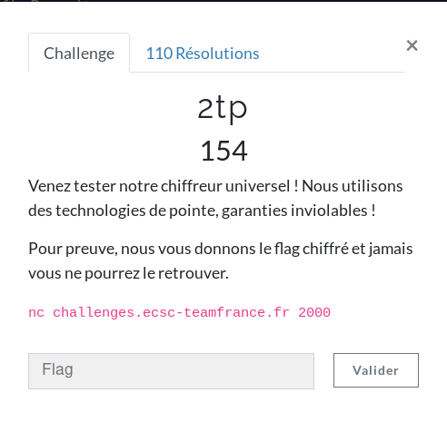
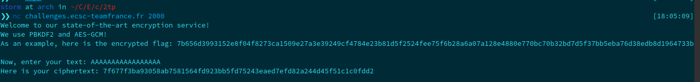
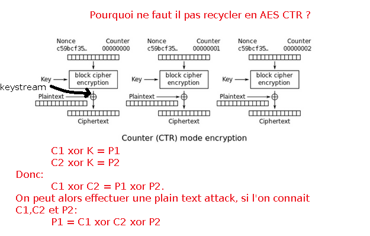
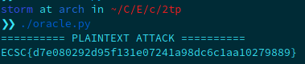

**2tp Write-Up**

When we connect to the netcat:



Ok, we are in front of an AES-GCM encryption algorithm. We're given the ciphertext1 (the flag, c1), and we can input a message1 (m1) to encrypt and we will get the ciphertext of this message (c2). We know that AES-GCM is a variation of CTR, and that the same key is used to encrypt all the blocks. However, the IV will change. We can perform an attack here. Indeed, I remembered about plaintext attack on https://aesctf.hackademint.org/challenges. There's also a nice picture that explains the way to go:



This is in fact the same attack as in Gallois Counter Mode. We can retrieve m1 by computing :

```
m1 = c1 ^ c2 ^ p2
```

To make the exploitation easier, I created a plaintext that, when encrypted, has the same length as the encrypted flag.

Here's my script:

```
#!/usr/bin/python2.7
# 2tp challenge by StormXploit 
# Plaintext attack on AES-GCM

print('========== PLAINTEXT ATTACK ==========')

# setting up variables, a message m, his cipher c1 and the encrypted flag c2
m1 = "AAAAAAAAAAAAAAAAAAAAAAAAAAAAAAAAAAAAAAAAAAAAAAA" 
c1 = "7f677f3ba93058ab7581564fd923bb5fd7c4e23bbf63f59448f4a5d22a36cb578190fa4a27d15997fe760e72bf3779a5f48b848033ad3c3eeeac396893a935"
c2 = "7b656d3993152e8f04f8273ca1509e27a3e39249cf4784e23b81d5f2524fee75f6b28a6a07a128e4880e770bc70b32bd7d5f37bb5eba76d38edb8d1964733b"

# decoding hex
c1 = c1.decode('hex')
c2 = c2.decode('hex')

# put all the chars in strings to number (ascii representation), to xor them
m1 = [ord(i) for i in m1]
c1 = [ord(i) for i in c1]
c2 = [ord(i) for i in c2]

# starting plaintext attack: m1 ^ m2 = p1 ^ p2
# xor the first number, we will have: m2 = m1 ^ c1
m2 = [t[0] ^ t[1] for t in zip(m1, c1)]

# xor its result with encrypted flag: m2 = m2 ^ c2
# -> m1 ^ (c1 ^c2) == m1 ^ m1 ^ m2 == m2 (our flag)
m2 = [t[0] ^ t[1] for t in zip(m2, c2)]

# giving ascii value to our flag
m2 = [chr(x) for x in m2]

print(''.join(m2))
```

 