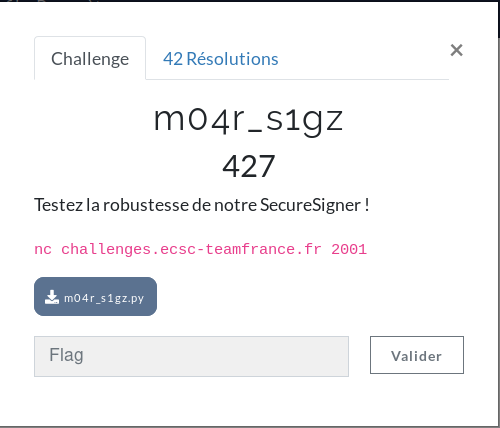
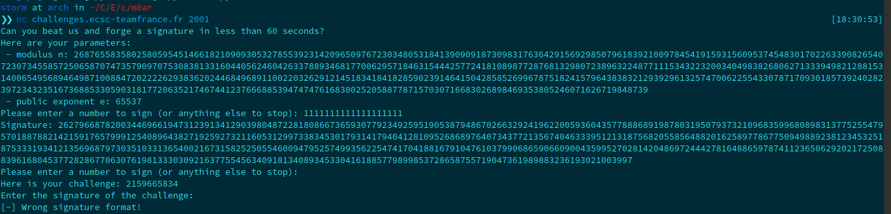
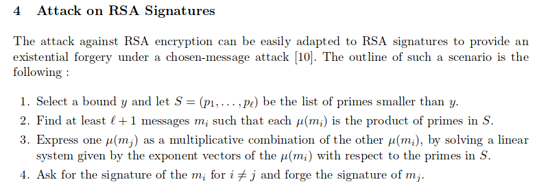
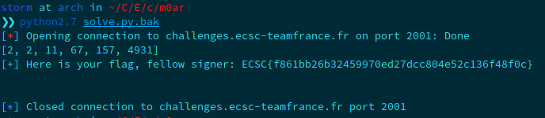

**m04r_s1gz Write-Up**

Let's try to connect to the netcat!



We're given a modulus ```n```, the public exponent ```e```, and we can ask the service to sign a number. At the end, we have a challenge (a number) and we should enter its signature. 

Let's take a look at the script provided by the challenge:

```
#!/usr/bin/python3 -u
from Crypto.PublicKey import RSA
import secrets
import signal
import sys


class SecureSigner():
    def __init__(self):
        self.private_key = RSA.generate(2048)
        self.e, self.n = self.private_key.e, self.private_key.n

    def sign(self, message):
        return self.private_key.sign(m, None)

    def verify(self, message, signature):
        return self.private_key.verify(message, (signature,))


if __name__ == '__main__':
    s = SecureSigner()

    print("Can you beat us and forge a signature in less than 60 seconds?")
    signal.alarm(60)

    print("Here are your parameters:\n - modulus n: {:d}\n - public exponent e: {:d}".format(s.n, s.e))

    while True:
        message = input("Please enter a number to sign (or anything else to stop): ")
        try:
            m = int(message, 10)
        except ValueError:
            break
        signature = s.sign(m)
        print("Signature: {:d}".format(signature[0]))
    
    challenge = secrets.randbelow(2**32)
    print("Here is your challenge: {:d}".format(challenge))
    
    signature = input("Enter the signature of the challenge: ")
    try:
        sig = int(signature, 10)
    except ValueError:
        print("[-] Wrong signature format!")
        sys.exit(-1)
    
    if s.verify(challenge, sig):
        with open("flag", "rb") as f:
            flag = f.read()
            signal.alarm(0)
            print("[+] Here is your flag, fellow signer: {:s}".format(flag.decode()))
    else:
        print("[-] Try again :(")
        sys.exit(-1)
```

What is interesting is that the challenge is only in range(2, 2**32)  so we will be able to calculate it. In order to understand the vulnerability, I read the chapter dedicated to RSA in the book  ```Serious Cryptography``` by J-P Aumasson. In addition, I searched on google about ```rsa chosen signature attack``` and found a nice pdf: http://www.dtc.umn.edu/~odlyzko/doc/index.calculation.rsa.pdf

Here are the steps in the pdf, to correctly execute the attack:



Our S group is in range(2, 2**32) as I wrote above. To compute its signature, we should find its list of primes, sign them and mod n the result. The following equation expresses the attack better:


where ```sign``` is the signature, ```s``` is the secret number (the challenge), ```p1``` is the first prime factor of s, and n is the modulus.

Our program will be divided in 2 main parts. First of all, do a list of all prime numbers in range(2, 9000), ask the application to sign them, store the signature in another list. Then make up a dictionary, mixing the first list of primes with their signatures. In the second part, decompose the challenge into prime factors, check and multiply their signatures, and do the modulo n operation. 

Here's the script:

```
storm at arch in ~/C/E/c/m0ar
❯❯ cat getflag.py                                                                                                                                              [18:34:11]
from pwn import *
import re
import itertools

#function to get number prime factor
def primeFactor(n):
    result = []
    for i in xrange(2,n):
        while n % i == 0:
            #print i,"|",n
            n = n/i
            result.append(i)
        if n == 1:
            break
    return result


#defined list with first primes numbers
number = 9000
primes = range(2, number+1)
for num in range(2,number + 1):
         for i in range(2,num):
            if (num % i) == 0:
                primes.remove(num)     
                break


#first connection to get the n and the signature
r = remote('challenges.ecsc-teamfrance.fr', 2001)
n = r.recvuntil('modulus n:')
n = r.recv()
n = re.search('\d+', n)
n = n.group(0)

signs_primes = []

#check signatures of prime factor between 0-9000
for i in primes:
    r.sendline(str(i))
    s = r.recv()
    s = re.search('\d+', s)
    signs_primes.append(s.group(0))
    
r.sendline('a')

#sign(x) = sign(prime_factor) [n]
#get the challenge
r.recvuntil('Here is your challenge:')
sign = r.recvuntil("\n")[:-1]

#decompose challenge with prime factors
primes_factor = primeFactor(int(sign))
print(primes_factor)

res = 1

#create a dico first with key -> prime number and values -> prime number's signature
dico = dict(itertools.izip(primes, signs_primes))

#checking if the challenge's prime numbers appears in our list
for i in primes_factor:
    if i in dico:
        res *= int(dico[i])
    else:
        break

#to get the flag after multiply all the signatures, just do modulo n operation
flag = res % int(n)
r.recv()
r.sendline(str(flag))
print(r.recv())
```

