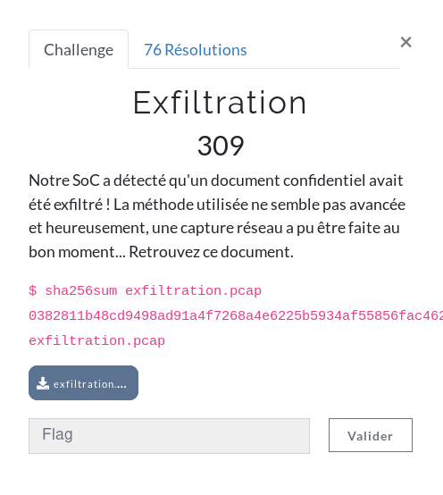
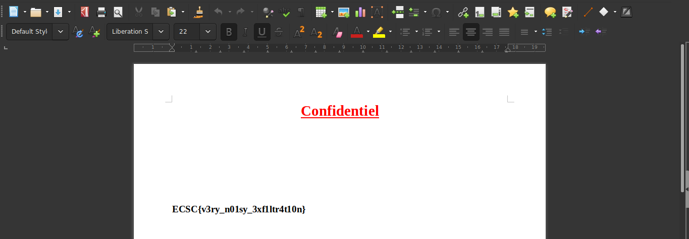

**Exfiltration Write-Up**

We are given a pcap file. Let's analyze it with tcpdump. 

```
storm at arch in ~/C/E/f/e/chall
❯❯ tcpdump -nr exfiltration.pcap udp|wc -l                                                                                                                     [17:26:31]
reading from file exfiltration.pcap, link-type EN10MB (Ethernet)
1364
```

Ok, there are 1364 UDP packets. Let's check TCP packets:

```
storm at arch in ~/C/E/f/e/chall
❯❯ tcpdump -nr exfiltration.pcap tcp|wc -l                                                                                                                     [17:27:36]
reading from file exfiltration.pcap, link-type EN10MB (Ethernet)
25866
```

Ok, now let's check all the packets:

```
storm at arch in ~/C/E/f/e/chall
❯❯ tcpdump -nr exfiltration.pcap |wc -l                                                                                                                        [17:28:18]
reading from file exfiltration.pcap, link-type EN10MB (Ethernet)
27242
```

Hmmm, let's see if the number we obtained is logical: 

```
storm at arch in ~/C/E/f/e/chall
❯❯ echo "25866 + 1364" | bc -qi                                                                                                                                [17:29:13]
25866 + 1364
27230
```

Oh, there are 12 packets left... Let's try to see where they are. 

```
storm at arch in ~/C/E/f/e/chall
❯❯ tcpdump -s 0 -A  -nr exfiltration.pcap not tcp and not udp                                                                                                  [17:30:19]
reading from file exfiltration.pcap, link-type EN10MB (Ethernet)
23:18:37.434515 IP 192.168.1.26 > 198.18.0.10: ICMP echo request, id 0, seq 0, length 8
E.......@..........
........
23:18:37.438237 IP 198.18.0.10 > 192.168.1.26: ICMP echo reply, id 0, seq 0, length 8
E...f'..4......
...........................B..
23:18:38.526199 IP 192.168.1.26 > 198.18.0.10: ICMP echo request, id 0, seq 0, length 8
E.......@..........
........
23:18:38.529140 IP 198.18.0.10 > 192.168.1.26: ICMP echo reply, id 0, seq 0, length 8
E...f~..4......
...........................5..
23:18:39.646903 IP 192.168.1.26 > 198.18.0.10: ICMP echo request, id 0, seq 0, length 47
E..C....@..........
........config : exfiltered_file_size=4193bytes
23:18:39.650153 IP 198.18.0.10 > 192.168.1.26: ICMP echo reply, id 0, seq 0, length 47
E..Cf...4..9...
............config : exfiltered_file_size=4193bytes
23:18:41.067100 IP 192.168.1.26 > 198.18.0.10: ICMP echo request, id 0, seq 0, length 31
E..3....@..........
........config : file_type=DOCX
23:18:41.070125 IP 198.18.0.10 > 192.168.1.26: ICMP echo reply, id 0, seq 0, length 31
E..3f...4......
............config : file_type=DOCX
23:18:42.159239 IP 192.168.1.26 > 198.18.0.10: ICMP echo request, id 0, seq 0, length 48
E..D....@..........
..LI....config : data_len_for_each_packet=random
23:18:42.162210 IP 198.18.0.10 > 192.168.1.26: ICMP echo reply, id 0, seq 0, length 48
E..Df...4......
......TI....config : data_len_for_each_packet=random
23:18:43.264340 IP 192.168.1.26 > 198.18.0.10: ICMP echo request, id 0, seq 0, length 31
E..3....@..........
........config : encryption=XOR
23:18:43.266807 IP 198.18.0.10 > 192.168.1.26: ICMP echo reply, id 0, seq 0, length 31
E..3f...4......
............config : encryption=XOR
```

The packets are there. It looks like it is a docx file encrypted with a xor. Now, let's extract these data with ```tcpflow```:

```
storm at arch in ~/C/E/f/e/chall
❯❯ cd flow/                                                                                                                                                    [17:33:05]
storm at arch in ~/C/E/f/e/c/flow
❯❯ tcpflow -r ../exfiltration.pcap                                                                                                                             [17:33:09]
reportfilename: ./report.xml
```

If you check the 12 packets left, which come from a certain IP addr, you will see (```head *198.018.000.010*```):

```
data=4b52f1cb47701a26acad748e477d1a501d076f452748b32d72d36d75884b355f6f2c5cee47c8307d545068ae2d78&uuid=80cxgrf7ws5phwlb7z3q
==> 192.168.001.026.56292-198.018.000.010.00443 <==
POST / HTTP/1.1
Host: 51.15.239.173:443
Connection: keep-alive
Accept-Encoding: gzip, deflate
Accept: */*
User-Agent: Mozilla/5.0 (Windows NT 10.0; WOW64) AppleWebKit/537.36 (KHTML, like Gecko) Chrome/74 Safari/537.36
Content-Length: 93
Content-Type: application/x-www-form-urlencoded
```

We will now try to get all those hexadecimal data in all the requests. 

```
storm at arch in ~/C/E/f/e/c/flow
❯❯ sed -n '/data=/s///p' *198.018.000.010*   | sed 's/&.*//'                                                                                                   [17:37:28]
3528706771637b6b6d63b9c7f82d736365637363656373636563786365632c11000f004c4b1116
0f16cee12e2e60326fe38c8e76268dae0f4eebbbad9
341310c479674e7fc8f9db3ab64400ac89cad226fd923e9c5a4cf1a96936fb108ad8d
c32bfff8e824a0d90a241243b2df53191bbe5e5c7c05b05cd9325de3b
72ffa2f49cfbdf7c104713aeceda63f8fcc574212cdf852052a31b45f0741c0c4f4
12aed592fb0c51c5fc42b6b309bb38de61c6982d9f44551f75c147e145153dc33
fdcd05d4d662d1c07a203c61ada129c0947f6691b2e0b9818d25b69ad83305
124bc22cb1a823a5d3bc5d4f04bd63823148c0a510c0fa8d9a41fb23b81f8aec7a0aa7891fc2328626b9bb36440aa6
365634e6165632328666767636d6b7b63afc7ee2d65637363656373636563736374637363120c01074a071c00100e1
60d114d0b0e098e242eeab94373d89424c3b9427ac770e9659565c699c24e47c584f012efa7c88ec20fe2f
3259e8ad6ba6449cf25f7300a7c13edf06aac1e0c6ded79bcae0c5c88
1eebb777b7a76e64f2b446613021205582dd5b4d8900cac47e716c0153aba1c8fb958bc49c8daf5b723
f15413fac476b6ea0a148e7eb50ad7a24dfac5a35c542461e695ff557c0fb47e0b237dbeaf2785000ba0
cf96545eac3da717734a55bc9bfcc2e857ef45a6ff16cdb417f7ace3494378f751e907f9cf5d0133d0a6d0e6
a59f26f53a2b97fa22aaeae72667e297befb2d5a09a49815abfea2786728616428059
dc24a744f5feffe2f0b2cbd426d20b0215e7c4a9f44708d7890e1bfc7177c126869bef0d5c31a
c688c7fe0957a3e202528d6181f4a49ffbdc389ab
d0ae93af99845b8dff6c331bae89e813e21f2dee54d08cb179f7a9fe11123ad9bed5516640d8
51ad4353926d3fb2af803e83781dc0bdcd1ac18fcbd9a8
b39db216c314506563c9de3a496188c80e97fc557f261e07c3ec10267e1
30d5387e10da0821401b6cce5ccad3ba5155966f2a1a79f237a106c30d4080c9cd8c432d09ce3
8d05baaef7f856542e9dc246e9c795ac696af1f4116db4c45f88aba6e33f398753fefcd0b08f
94d0988459d7fef2d9fd217399898c9997c0087941c047707581b2e808cc43bb47d04eba5e6f24d515ea573100
ab09860b8e12164b7f23958f33a3dace1c5aedf115a7749797dff61070844b011071
ae81e0a2ffd3e7bd70b2cdbbe3af043763a006b3037f931851582ff60fdb7d6f9d2b282
8daf62c6dc5ae41133ced2860c59e40202f442e7db8a1ff4fb8dd5e321
7383e58cd68ac3f408f953eacac7ce5c5cc623528746
bd80f897802617363206e73633528706771637b6b6d63b9c7f82d7363656373636563736365637c636563040c1
7075c10111a1f06164d0b0e09a6268c2ab8437398ddcc41
9794e1e1b5372667a1e9d93627be4703baccbdc69093dc9a79298a8802d8ba65287323
c58828e01872fcacde12153cad8bf6bf8db5f243d905
e47420f3c295c571192ad3fe889a03a15181c32ef33500a4553b8f8997b0aa1f2
f0d40f4d1c33db61b2ed3f09405ff82a724cbe56dff267811e6126f1f7bbe573c68343f044b71e091398522a092a43
9e2a3cf48100bbf4cc77714e32f966cdd32caca4fa242f66fa87ce48c2ebad5e
581dc42c7a3aeb51373993a950152c795f837e500e9fc042e0e6f4f0
18b459304c4d2b4b79378cfc5f5ed018dddc94509c187fb7f8e5a38eae2cb736
0d8676811c2cfb2bc764932d4f329fe0e1955e6259def67718f711ca59
449d8672e42a2cc0320e4fd814f8d216c72dd663ac3c08675eab3
4b45324c3e6f868383899a4d6ac8b2077bc2f64b66c6e67ba9850202bb57e78cd30a04c09d3bf
8b1c944d212028705d208754c9d598c5bfbe3441f8d5255bb0fa
4a2a1e238264d4a50487855eaedbac7da65f60e4a6eef19995a3ecd83
4c40996a550240e8082a2088aecc164a8a8b39c85c50a746bc62d8a070d
46675f52c17fa72698c18e82ce4922cd5bf5908a24ec7fef4ecd3
ae28834796c9a31525422955efafc3978bb1f61157170c90d2c2c7a2a555d0ba026896bd5609ec8fdce6b
9f05ef13aa9dd5b1f46a96c76c0b38bceebf42479dc65fa2f228fe2ab2a474d8df61bacc54b6
68a2d266a9f88808ac35fdf5f89cfbb16143cef70c31279595f389946a21803f91908389b10d86901bc087045
fdfd7c8c4bb30a7b9c8d21e99e8ce13d0efe89c8a02ff21bac320ce88d56e8bd10149e25d4dc6533386
46dbf87b33f03716365aa7b63653338606177736b6d6b73a9c1fe3d63656
37363656373636563737f656373140a11174c3a11160f164c170c06161e060b175d1b080f5d11000f00cef42
e79a15573f694fb41bfbdc33663f2c30d37134e967352f8d5b2556caa5b191e60f9394d81b186991e9c52
4a3c2c98eb3ea36408eef34f2ce2d232d3b1d572154bc4b040cff82adba43d31396ade15e4a6687061d7
370da01a234e935157b5c4eae0b99f3d214f18a0ee3742ba53fcc08af1982a6567604
3b8266199cdb9e3f054f4dcd50e2e08e078d8ad587969f285e21d7ee32be7
dd247183cbf6ab725d4b5c88c4190e7ef697bb92b8a4c88
6aea19fdc5c25c1eb868274edfec2e63aad628265143528746b9c4c43a3a063736
3766173633528706771637b6b6d63b9c7f82d73636563736365637363656362636563040c17075c10001707
0a0b04004d1d0e1f26eb287da1556f3794f941817d773b83ca2dd89061a5623108c5311124d4c2b38a6c48e5c052
5009988bf6d11a07f2e2aaa61192a345964fef1190035d78852853c7
e2f573fcb3b07860d905d5fa7932b6bf71207c2df9baa038564
4b52f1cb47701a26acad748e477d1a501d076f452748b32d72d36d75884b355f6f2c5cee47c8307d545068ae2d78
f5b74956265cfe522b720db79f600ce592087d314d86cd51af485683528746
b13b6fdcec0637363b56373633528706771637b6b
6d63b9c7f82d73636563736365637363656361636
563040c17075c050a0d073704011f064b1b1e0fc833322da65363df9669b8148fd774e7c7c5667187e709c380622
804b63bc1b4f4b4579792db3d4844abd2c3bb8feebafcba2acd5afe665e6355ed495cfc6631450a2c785f37811e9
2118c4b6024d379c944df87743add3412a8d20f5926650af8
db6f49bca5abf62fd21db264ac0fe4f1d3b56462520ea0246e4db7389369faf6d9c00934777ca9e4420af56cb4bb9b
c35269fcd89d032b14777a0b44c578db507eb8b65cfe6b2967f
4318ce920657879a7e81425fad3386def542d6ad5e1264436ad60028f825168faede2ab27ae3d835e7760
1ee8542be805cc2fd224c49413b118120eccd427fcd5e95fee64b09f2ac8
24d0a2f3b8753e6fd5aacb039045c474eefc18c8da079638e493587a632c6
07808d95badece95f5c0b96603338646da2b4ba6d7e726365367063653338606177736b6d6b73a9c1fe3d6365637
3636563736365637373656373070a0023110a13004c0413034d1d0e1ffef42818615477f694987630138e076fcfe
f07511eb5f623c2b6b9aef343b4eaf7ace057e99b982d76
89b3161492876fdd9e6b287e28fc6e43218e1f26431a3251d5b15a0eb
ee9cfb44a8076aa077125eabb3adbab6c412a925ed57aad262b6901e3676848b7c697f4f125aae2745234b8c7d0
00a2ede741d7b18e0539a7d0e0186655a2d14d0567ed6ccf7156935453da77f4f497
3acb0191593c8fcb2a7d0affb0030f4c7713351caeb956b2b2b973fc86903ed3628c084e20a1f893
d09d79931f0a328c9651ec84800bde8e9bbb0f4d03ae1ff968617ecd956e815fe64a3
5ec1ebed812ac8b63a453c1f6ab42ef2d68d3163226ebca18a2fb5962e7299b6c1fefcaf27f3d38eed9524c579f68
6e7f8f712768e78a4d8be2271248569a622328626b78c918
266c626563736165632328666767636d6b7b63afc7ee2d6563736
3656373636563736374637363010c1033170c03104a001c11004d0b0e09ee213e2aa1437718942
44f18bcc96ee6dbc3f2cd823a71764369bc0f186a
b6c808a968e61c1cd4d4e2b9e00a94af101f8d24c4d6202a1b1e5325354f46
2273776c67cce1370a29b3c8ca5c44fd36c5614859664c5af146d68f15a910a158604ac5a103
35e186fff4d17ab44cba5189e131b8d43551685be01197c557463064282d46803a
4f7479e282ebf5e52f4307d1528796852b3df5e76ce51902e9a523156976f7c5b3
a14bed8b2ae80529089624a82f4b2eea346e32c64e5acd6c256da7d9dde01fb7393e9a720e38594ca83218cae93614
43aa97b12bb16e5567925ae6c758b456ccd0a4c2b6
ef07147bae9884ce6cbccac10271e22a0f945bc6ccbd52e52e3ffccf12aca5a6714f5231d0
d804248d2b5d3f43f68abfb150359d09ba2fe52710afe12a3fddc01c47ede4d090dd
f198584f2cca1cea57e9dbcc4d358968b9b96593d18a183c
b7657e05b0c6be181f71a40bc772db7d4665b3c09883ac1aafcd623528746bd756b6f50662
7363be6173633528706771637b6b6d63b9c7f82d7363656373636563736365636063656328200a0d07060b172c371c
131610384d0b0e09dee75c2aa04373a0940de9ad48397f7d73312a5e4
34221e25350003a71f89bea1fd5d7bafd00384767db72d1d32bd1198c8ebdb82add750e5
017486dcbeecebc1a22d169cf0729becd156ca80e0da673902ab
6095f1325d07518b5a28bdc5a22baf0723d5b7cf53b3964efed177e7e
92214de86b9b363a3b119a0f617880fb59bbcfd9423fa369d7
c67b922b7bdb7a1a6f43434ab1bad1fefe53520e45cf7cd177e29194f626fc0d9aedf7f1b8698
fd0a44049059f08b1ce68f948423c7f42ef378b40fb08284e04b75454
7aff7727fffb6ae994a67b0e421013bf69e3d42cd490eea78ac58d127d9cc562e17b5a883a97cd14fbe
fa371d1723c60f95db00b184b77aaf2a20a87615
84961c92ada2380f7b020ed99839922d50782729ecc8c59cacc710276ac9d729044332e647ba247793a496
463733d616373332e6271776577736b6d6b73a9c1fe3d8bb56250ba65
63735e6763736865637363656373636563736365637363653c0106091
05c4d17061f1035287261716367636d6b7b63afc7ee2dd80f897802617363206e73637463736365637363656
37363656361626563040c17075c070a00060e000d074d1d0e1f332e6271776577736b6d6b73a9c1fe3dbf91b32903
676373aa6d63736c65637363656373636563736365db706365141c11014c00171c0f16104b1b1e0f352872617163
67636d6b7b63afc7ee2d9c4c43a3a06373637661
7363796373636563736365637363656326656563040c17075c3c17061f104a071c00100e160d114d0b
0e094d0106091023286461676371637b6b6d63b9c7f82d05b6ebced6636563a363656362
6365637363656373636563736301647363120c010
74a101617110a1d04164d0b0e09333862677773776
56b7b6b65a9d7fe2ba2b4ba6d7e7263653670636571736365637363656373636563732b6d6373140a11174c030
c1d173102110f004d0b0e0933386267777377656b7b6b65a9d7fe2b68d91e207c726365
637163657373636563736365637363656373c66c6373070a0023110a13004c041303
4d1d0e1f332e6271776577736b6d6b73a9c1fe3dd150a6e
500646373b8676373726563736365637363656373636561786365071c0035111c13164c100c17065d1b
080f23286461676371637b6b6d63b9c7f82db2417f2a596265632
d6765636063656373636563736365637363c16f73633e201c0d11061d173a370a1300102e4d1d0e1f332e6675
636563736a656a735f6763736c6b63736365
```

Ok, now we redirect all of this in a file and convert in binary with the command 

```
storm at arch in ~/C/E/f/e/c/flow
❯❯ sed -n '/data=/s///p' *198.018.000.010*   | sed 's/&.*//'| xxd -p -r > somedata 
```

 and we will use ```xortool``` to guess the key length. 

```
storm at arch in ~/C/E/f/e/c/flow
❯❯ python xortool/xortool/xortool -b somedata                                                                                                                  [17:43:25]
The most probable key lengths:
   2:   12.8%
   4:   15.4%
   6:   10.8%
   8:   12.7%
  10:   8.9%
  12:   10.4%
  14:   7.4%
  16:   8.5%
  18:   6.0%
  20:   7.0%
Key-length can be 4*n
```

Apparently, the key length is 4. Let's try to bruteforce it. After dropping the data in a website that bruteforce xor key, it finally finds ```ecsc```.

```
storm at arch in ~/C/E/f/e/c/flow
❯❯ python2.7 xortool/xortool/xortool-xor -s ecsc -f somedata  > flag.docx
```

Open the flag.docx file:

