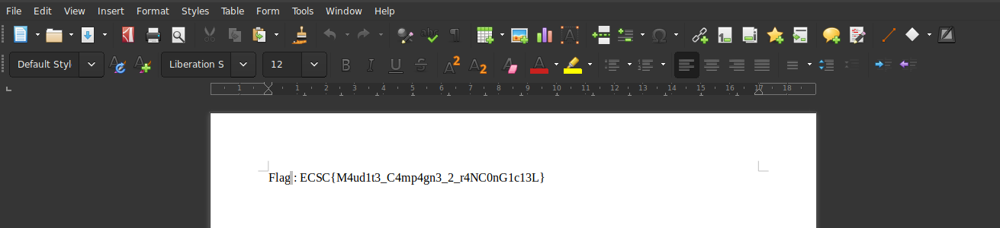

<u>**Incident Response Parts 1, 2 and 3**</u>


**Part 1**

<u>TL;DR</u>

This challenge was a memory dump analysis in 3 parts, based on a ransomware attack. In this first part, we should identify the process name of the ransomware, its PID, and the file flag.docx encrypted (his sha1 hash).

Let's get started!

<u>Finding the evidences through the memory dump</u>


With volatility, we tried to identify the profile for this dump but it didn't work. Interesting, if I remember well, I already had an issue like this in another CTF. Run the ```crashinfo``` command with volatility:


What you should notice is the ```MachineImageType```. At this point, I definitely remembered which challenge I did last December, and which has the same issue. If you want, I did a Write-Up on this challenge, you can see here: https://github.com/StormXploit/Write-Up/blob/master/SanthacklausCTF_2k18/Write-Up%20Forensic%20%20Bret%20Stiles.md

The problem with the profile is that the windows 10 image we deal with is more recent than the one used usually (Win10x64), this is a problem of version. We should use ```Win10x64_10586``` profile instead. Let's try with this profile, and run ```pslist``` command to take a look at the processes. 

```
storm at arch in ~/C/E/f/I/Write-Up
❯❯ volatility -f mem.dmp --profile=Win10x64_10586 pslist                                                                                                       [15:06:31]
Volatility Foundation Volatility Framework 2.6.1
Offset(V)          Name                    PID   PPID   Thds     Hnds   Sess  Wow64 Start                          Exit                          
------------------ -------------------- ------ ------ ------ -------- ------ ------ ------------------------------ ------------------------------
0xffffe0000f65a040 System                    4      0    136        0 ------      0 2019-05-08 19:57:03 UTC+0000                                 
0xffffe00010e4b040 smss.exe                256      4      3        0 ------      0 2019-05-08 19:57:03 UTC+0000                                 
0xffffe00010ef2080 csrss.exe               360    348     11        0      0      0 2019-05-08 19:57:05 UTC+0000                                 
0xffffe00011302080 wininit.exe             472    348      4        0      0      0 2019-05-08 19:57:05 UTC+0000                                 
0xffffe00011305180 csrss.exe               480    464     13        0      1      0 2019-05-08 19:57:05 UTC+0000                                 
0xffffe00011344080 winlogon.exe            544    464      5        0      1      0 2019-05-08 19:57:05 UTC+0000                                 
0xffffe00011399840 services.exe            592    472     20        0      0      0 2019-05-08 19:57:05 UTC+0000                                 
0xffffe000113a2840 lsass.exe               604    472     10        0      0      0 2019-05-08 19:57:05 UTC+0000                                 
0xffffe000113dd480 svchost.exe             684    592     28        0      0      0 2019-05-08 19:57:05 UTC+0000                                 
0xffffe000113f2180 svchost.exe             740    592     13        0      0      0 2019-05-08 19:57:06 UTC+0000                                 
0xffffe00011739080 dwm.exe                 836    544     13        0      1      0 2019-05-08 19:57:06 UTC+0000                                 
0xffffe00011779840 svchost.exe             944    592     76        0      0      0 2019-05-08 19:57:06 UTC+0000                                 
0xffffe00011789840 svchost.exe             964    592     23        0      0      0 2019-05-08 19:57:06 UTC+0000                                 
0xffffe0001178c840 svchost.exe             972    592     25        0      0      0 2019-05-08 19:57:06 UTC+0000                                 
0xffffe0001179c840 svchost.exe            1000    592      9        0      0      0 2019-05-08 19:57:06 UTC+0000                                 
0xffffe000117e0840 svchost.exe             296    592     19        0      0      0 2019-05-08 19:57:06 UTC+0000                                 
0xffffe000117e1080 vmacthlp.exe            668    592      4        0      0      0 2019-05-08 19:57:06 UTC+0000                                 
0xffffe0000f685840 svchost.exe            1036    592     30        0      0      0 2019-05-08 19:57:06 UTC+0000                                 
0xffffe0000f683840 svchost.exe            1216    592     21        0      0      0 2019-05-08 19:57:06 UTC+0000                                 
0xffffe00011617840 spoolsv.exe            1304    592     16        0      0      0 2019-05-08 19:57:06 UTC+0000                                 
0xffffe00011cc45c0 svchost.exe            1652    592     13        0      0      0 2019-05-08 19:57:07 UTC+0000                                 
0xffffe00011cf1840 VGAuthService.         1712    592      3        0      0      0 2019-05-08 19:57:07 UTC+0000                                 
0xffffe00011cff840 vmtoolsd.exe           1732    592     10        0      0      0 2019-05-08 19:57:07 UTC+0000                                 
0xffffe00011d0a840 svchost.exe            1760    592     11        0      0      0 2019-05-08 19:57:07 UTC+0000                                 
0xffffe00011d1b840 MsMpEng.exe            1776    592     42        0      0      0 2019-05-08 19:57:07 UTC+0000                                 
0xffffe000115ae840 WmiPrvSE.exe           2244    684     10        0      0      0 2019-05-08 19:57:09 UTC+0000                                 
0xffffe000115ac840 dllhost.exe            2308    592     16        0      0      0 2019-05-08 19:57:09 UTC+0000                                 
0xffffe0000f823340 msdtc.exe              2464    592     13        0      0      0 2019-05-08 19:57:10 UTC+0000                                 
0xffffe0000f839840 NisSrv.exe             2708    592     12        0      0      0 2019-05-08 19:57:10 UTC+0000                                 
0xffffe00010aba840 sihost.exe             2204    944     14        0      1      0 2019-05-08 19:57:14 UTC+0000                                 
0xffffe00011fa8840 taskhostw.exe          2168    944     11        0      1      0 2019-05-08 19:57:14 UTC+0000                                 
0xffffe00012023580 RuntimeBroker.         3092    684     23        0      1      0 2019-05-08 19:57:14 UTC+0000                                 
0xffffe00012034080 userinit.exe           3120    544      0 --------      1      0 2019-05-08 19:57:14 UTC+0000   2019-05-08 19:57:38 UTC+0000  
0xffffe000116e3080 explorer.exe           3184   3120     86        0      1      0 2019-05-08 19:57:14 UTC+0000                                 
0xffffe00012077240 SkypeHost.exe          3220    684     37        0      1      1 2019-05-08 19:57:14 UTC+0000                                 
0xffffe0001225b840 SearchIndexer.         3444    592     31        0      0      0 2019-05-08 19:57:15 UTC+0000                                 
0xffffe00011f8f7c0 ShellExperienc         3576    684     28        0      1      0 2019-05-08 19:57:15 UTC+0000                                 
0xffffe000122aa840 svchost.exe            4452    592      9        0      1      0 2019-05-08 19:57:23 UTC+0000                                 
0xffffe00012620080 vmtoolsd.exe           4812   3184     10        0      1      0 2019-05-08 19:57:27 UTC+0000                                 
0xffffe000125fb840 WmiPrvSE.exe           4916    684     12        0      0      0 2019-05-08 19:57:28 UTC+0000                                 
0xffffe00012774080 OneDrive.exe           3080   3184     17        0      1      1 2019-05-08 19:57:29 UTC+0000                                 
0xffffe000125a7840 firefox.exe            4040   3184     59        0      1      1 2019-05-08 19:59:06 UTC+0000                                 
0xffffe000125f7840 firefox.exe            4896   4040      9        0      1      1 2019-05-08 19:59:07 UTC+0000                                 
0xffffe00010385080 firefox.exe            4736   4040     20        0      1      1 2019-05-08 19:59:08 UTC+0000                                 
0xffffe00010347080 firefox.exe            3744   4040     19        0      1      1 2019-05-08 19:59:09 UTC+0000                                 
0xffffe00011196080 firefox.exe            3256   4040     22        0      1      1 2019-05-08 19:59:11 UTC+0000                                 
0xffffe00011f8b080 SearchProtocol         5060   3444      7        0      0      0 2019-05-08 19:59:31 UTC+0000                                 
0xffffe000127446c0 firefox.exe            5084   4040      0 --------      1      1 2019-05-08 19:59:33 UTC+0000   2019-05-08 20:01:04 UTC+0000  
0xffffe00012155200 firefox.exe            1360   4040     19        0      1      1 2019-05-08 19:59:42 UTC+0000                                 
0xffffe00012530080 MpCmdRun.exe           3248   4932      7        0      0      0 2019-05-08 19:59:43 UTC+0000                                 
0xffffe000125b8080 SearchUI.exe           3888    684     61        0      1      0 2019-05-08 20:00:03 UTC+0000                                 
0xffffe000126d3080 audiodg.exe            2624    964      8        0      0      0 2019-05-08 20:00:15 UTC+0000                                 
0xffffe000106bb840 assistance.exe         5208   3184      9        0      1      1 2019-05-08 20:00:16 UTC+0000                                 
0xffffe00010335080 conhost.exe            5224   5208      2        0      1      0 2019-05-08 20:00:16 UTC+0000                                 
0xffffe00012268100 notepad.exe            5444   3184      1        0      1      0 2019-05-08 20:00:29 UTC+0000                                 
0xffffe0001214e080 notepad++.exe          5496   3184      0 --------      1      1 2019-05-08 20:00:33 UTC+0000   2019-05-08 20:00:41 UTC+0000  
0xffffe00012910080 svchost.exe            5792    592      4        0      0      0 2019-05-08 20:00:58 UTC+0000                                 
0xffffe00012854840 MSASCui.exe            5840   3184      6        0      1      0 2019-05-08 20:01:01 UTC+0000                                 
0xffffe000126b7840 WUDFHost.exe           6100    296     10        0      0      0 2019-05-08 20:01:27 UTC+0000                                 
0xffffe0001287a840 notepad++.exe          5176   3184     11        0      1      1 2019-05-08 20:01:49 UTC+0000                                 
0xffffe00010441600 taskhostw.exe          3192    944      7        0      1      0 2019-05-08 20:02:15 UTC+0000                                 
0xffffe000123e21c0 SearchFilterHo         4320   3444      4        0      0      0 2019-05-08 20:02:52 UTC+0000                                 
0xffffe0001051c840 DumpIt.exe             5596   3184      6        0      1      0 2019-05-08 20:04:09 UTC+0000                                 
0xffffe0001051b080 conhost.exe            5364   5596      4        0      1      0 2019-05-08 20:04:09 UTC+0000 
```

Ok. Without further do, let's analyze this. We can see usual processes like ```svchost.exe``` etc, but if you are familiar with Windows memory dump analysis, you'll rapidly see shady process. Indeed, I never saw before ```assistance.exe```. Even more suspicious, its parent process is PID 3184, ```explorer.exe```. If you want to confirm what I said, you can dump this process and put in on hybrid-analysis or virus total:

```
storm at arch in ~/C/E/f/I/Write-Up
❯❯ volatility -f mem.dmp --profile=Win10x64_10586 procdump -p 5208 -D .                                                                                        [15:12:25]
Volatility Foundation Volatility Framework 2.6.1
Process(V)         ImageBase          Name                 Result
------------------ ------------------ -------------------- ------
0xffffe000106bb840 0x0000000000400000 assistance.exe       OK: executable.5208.exe
```


The report confirms what I said, the executable looks malicious, and is detected by 22% of AV.

We now have a part of the flag: ECSC{assistance.exe:5208:??????}

Let's find the flag.docx encrypt. First, I scan all the files available in the dump using ```filescan``` command, then redirect the output into a file named ```files.txt```.


Here, you can see a file named ```ZmxhZy5kb2N4.chiffré```, it seems to be a file encrypted by the ransomware. Moreover, if you look more carefully at the name of the file, there's a base64 pattern. Let's decode this filename:

```
storm at arch in ~/C/E/f/I/Write-Up
❯❯ echo "ZmxhZy5kb2N4" | base64 -d                                                                                                                           1 [15:29:39]
flag.docx         
```

 Oh, that's the file we are looking for. Great, let's get the sha1 of the filename:


The flag for the first step is ```ECSC{assistance.exe:5208:c9a12b109a58361ff1381fceccdcdcade3ec595a}```


**Part 2**

In this part, we should retrieve the key from the ransomware, that serves to encrypt user files. In order to do this, we should identify the ransomware which we are investigating on. Firstly, I dumped the memory of the ```assistance.exe``` process.

```
storm at arch in ~/C/E/f/I/Write-Up
❯❯ volatility -f mem.dmp --profile=Win10x64_10586 memdump -p 5208 -D .                                                                                         [15:31:57]
Volatility Foundation Volatility Framework 2.6.1
************************************************************************
Writing assistance.exe [  5208] to 5208.dmp
```

Next, I tried to identify the ransomware we are dealing with:

```
storm at arch in ~/C/E/f/I/Write-Up
❯❯ strings 5208.dmp | grep "ransomware"                                                                                                                        [15:42:56]
%github.com/mauri870/ransomware/client
'github.com/mauri870/ransomware/cryptofs
path	github.com/mauri870/ransomware/build/ransomware
mod	github.com/mauri870/ransomware	(devel)	
github.com/mauri870/ransomware/cryptofs.(*File).Encrypt
github.com/mauri870/ransomware/cryptofs.(*File).ReplaceBy
github.com/mauri870/ransomware/utils.GenerateRandomANString
github.com/mauri870/ransomware/utils.StringInSlice
github.com/mauri870/ransomware/utils.SliceContainsSubstring
github.com/mauri870/ransomware/utils.GetDrives
github.com/mauri870/ransomware/utils.GetCurrentUser
github.com/mauri870/ransomware/utils.RenameFile
github.com/mauri870/ransomware/utils.init
github.com/mauri870/ransomware/cmd.glob..func1
github.com/mauri870/ransomware/cmd.init.ializers
github.com/mauri870/ransomware/cmd.init
github.com/mauri870/ransomware/client.New
go.(*struct { Files []*github.com/mauri870/ransomware/cryptofs.File; sync.Mutex }).Lock
go.(*struct { Files []*github.com/mauri870/ransomware/cryptofs.File; sync.Mutex }).Unlock
```

Apparently, the ransomware is open-source, so we will be able to analyze its source code. In addition, we can deduct that the ransomware was written in golang language with the 2 last lines above. The next step is very laborious, we should read the code on the github, let's do this:


After reading the readme.md file, we know that files are encrypted with AES-256-CTR algorithm. Moreover, the key is in the attacker server and should be 32 hexadecimal characters long, and it has been used to interact with the victim's computer, in order to encrypt its files. If you try to grep something like that ```POST api/keys/add```, you'll get the payload but this is not interesting for us. Also, we learn that a file named unlocker.exe can decrypt the files. Let's try to dump it, first find its offset and then dump it:

```
0x0000e00012390090     14      0 R--r-d \Device\Mup\;Z:000000000002acd3\vmware-host\Shared Folders\e\unlocker.exe
```

```
storm at arch in ~/C/E/f/I/Write-Up
❯❯ volatility -f mem.dmp --profile=Win10x64_10586 dumpfiles -Q 0x0000e00012390090 -D .                                                                     130 [15:45:44]
Volatility Foundation Volatility Framework 2.6.1
```

It didn't work. Try to recover it with foremost:

```
storm at arch in ~/C/E/f/I/Write-Up
❯❯ mkdir executables                                                                                                                                         1 [15:55:40]
storm at arch in ~/C/E/f/I/Write-Up
❯❯ cd executables/                                                                                                                                             [15:56:01]
storm at arch in ~/C/E/f/I/W/executables
❯❯ foremost -t exe -i ../mem.dmp -o .                                                                                                                          [15:57:11]
Processing: ../mem.dmp
|**************|
storm at arch in ~/C/E/f/I/W/executables
❯❯ cd exe/   

storm at arch in ~/C/E/f/I/W/e/exe
❯❯ strings * | grep -r unlock                                                                                                                                1 [16:02:41]
Fichier binaire 01771384.exe correspondant
```

Nice, the binary that seems to correspond with the unlocker is ```01771384.exe```. Move it to ```unlocker.exe``` and open GHIDRA with the file. 


Hmmm. GHIDRA has some trouble while opening it. Definitely not the way to go ... Let's analyze the source code of the ransomware, on github.

With the example here: https://github.com/mauri870/ransomware/blob/master/cryptofs/file.go, we can see that the IV is chosen randomly, it may be useful later. At the end of this file: https://github.com/mauri870/ransomware/blob/master/client/client.go, 


Ok, now, try to grep "enckey" in the assistance.exe dump, to see if there's either the id or the encryption key.

```
storm at arch in ~/C/E/f/I/Write-Up
❯❯ strings 5208.dmp | grep -C 4 "enckey"   
```

The -C option with grep allows us to see four lines around the word we search. We found this:


Bingo! We matched the same pattern that we found in the code, but the enckey is way too long to be the one we are searching, quite weird ? Not really, taking a look at https://github.com/mauri870/ransomware/blob/master/cmd/ransomware/ransomware.go, we can see this :


Let's take a look at this function, ```GenerateRandomANString()```. This function is created here: https://github.com/mauri870/ransomware/blob/master/utils/utils.go 


So, if we divide the enckey as follows:

```
cd18c00bb476764220d05121867d62de
64e0821c53c7d161099be2188b6cac24
cd18c00bb476764220d05121867d62de
64e0821c53c7d161099be2188b6cac24
95511870061fb3a2899aa6b2dc9838aa
422d81e7e1c2aa46aa51405c13fed15b
95511870061fb3a2899aa6b2dc9838aa
422d81e7e1c2aa46aa51405c13fed15b
```

we have this: 

```
cd18c00bb476764220d05121867d62de
64e0821c53c7d161099be2188b6cac24
cd18c00bb476764220d05121867d62de
64e0821c53c7d161099be2188b6cac24
```

where cd18c00bb476764220d05121867d62de is the key ID and 64e0821c53c7d161099be2188b6cac24 is random generated string.

Nice, let's do the same for the second part of the enckey:

```
95511870061fb3a2899aa6b2dc9838aa
422d81e7e1c2aa46aa51405c13fed15b
95511870061fb3a2899aa6b2dc9838aa
422d81e7e1c2aa46aa51405c13fed15b
```

So 95511870061fb3a2899aa6b2dc9838aa will be our key and 422d81e7e1c2aa46aa51405c13fed15b the random generated string. Flag : ```ECSC{95511870061fb3a2899aa6b2dc9838aa}```


**Part 3**

For this last part, we have a given file, that is the flag.docx, and we should decrypt it. Let's do it! We should get the IV before decrypting the file. If you read the readme.md of the ransomware, the author said that the IV is in the first 16 bytes of the file. As I remembered that here:https://github.com/mauri870/ransomware/blob/master/cryptofs/file.go we have a decrypt function that automatically takes care of the IV, I decided to use it for the sake of optimization. I just created a main function with the key, and gave my file in input and the one to create in output:

```
❯❯ cat decrypt.go                                                                                                                                              [17:11:21]
package main

import (
	"crypto/aes"
	"crypto/cipher"
	"io"
	"os"
	"log"
)

func Decrypt(filename string, key string, dst io.Writer) error {

	// Open the encrypted file
	inFile, err := os.Open(filename)
	if err != nil {
		return err
	}
	defer inFile.Close()

	// Create a 128 bits cipher.Block for AES-256
	block, err := aes.NewCipher([]byte(key))
	if err != nil {
		return err
	}

	// Retrieve the iv from the encrypted file
	iv := make([]byte, aes.BlockSize)
	inFile.Read(iv)

	// Get a stream for encrypt/decrypt in counter mode (best performance I guess)
	stream := cipher.NewCTR(block, iv)

	// Open a stream to decrypt and write to dst
	reader := &cipher.StreamReader{S: stream, R: inFile}

	// Copy the input file to the dst, decrypting as we go.
	if _, err = io.Copy(dst, reader); err != nil {
		return err
	}

	return nil
}

func main() {
	key := "95511870061fb3a2899aa6b2dc9838aa"
	outfile, err := os.Create("flag.docx")
	Decrypt("data", key, outfile)
	if err != nil {
		log.Fatal(err)
	}
}
```

Build the binary file and execute it:

```
storm at arch in ~/C/E/f/I/W/Part3
❯❯ go build decrypt.go                                                                                                                                         [17:11:40]
storm at arch in ~/C/E/f/I/W/Part3
❯❯ ./decrypt                                                                                                                                                   [17:11:49]
storm at arch in ~/C/E/f/I/W/Part3
❯❯ ls                                                                                                                                                          [17:11:52]
data  decrypt*  decrypt.go  flag.docx
```

We now have the flag.docx file, open it up!



