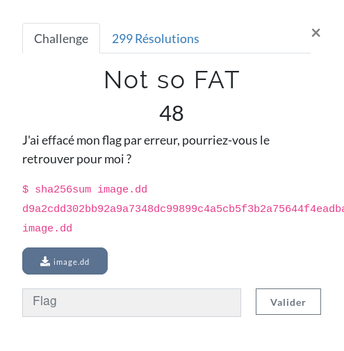
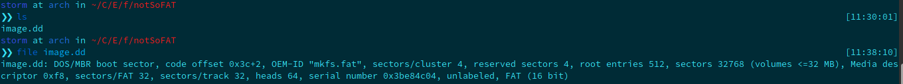
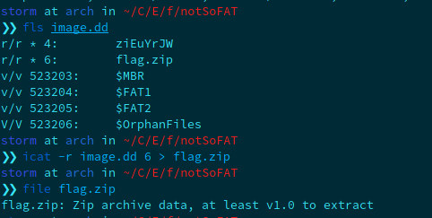
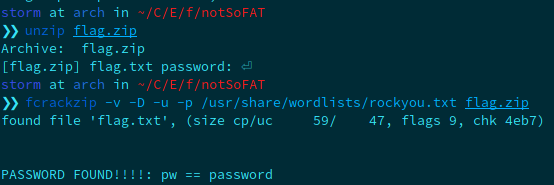
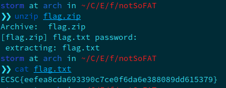

**Not so FAT Write-Up**

This challenge is the first one of the forensics category. The name of the challenge let us expect a FAT image. First thing I did after downloading the file, was the ```file``` command on it.



Even though the challenge description explicitly said that we should recover the flag, we even try to mount the image.dd (with mount command) unsuccessfully. Then, I remembered about another forensics chall, where we had to use the ```Sleuth Kit```. It allows us to recover files that have been deleted on a device. Let's test with ```fls``` command.



With fls, we can see the nodes where there are files that have been deleted by the user. To recover the node 6, which is the ```flag.zip``` file, we use the package ```icat``` provided in the sleuth kit. The option ```-r``` allows us to extract the node provides after. Unfortunately, as you'll see in the following screenshot, the flag.zip file is password protected. To crack it, I used ```fcrackzip``` with rockyou dictionary, it was very fast!



Nice gu3ss1ng, the password is ```password```. Unzip the file and get the flag:

