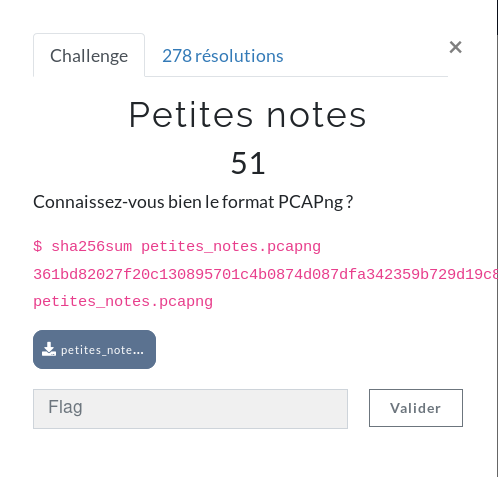
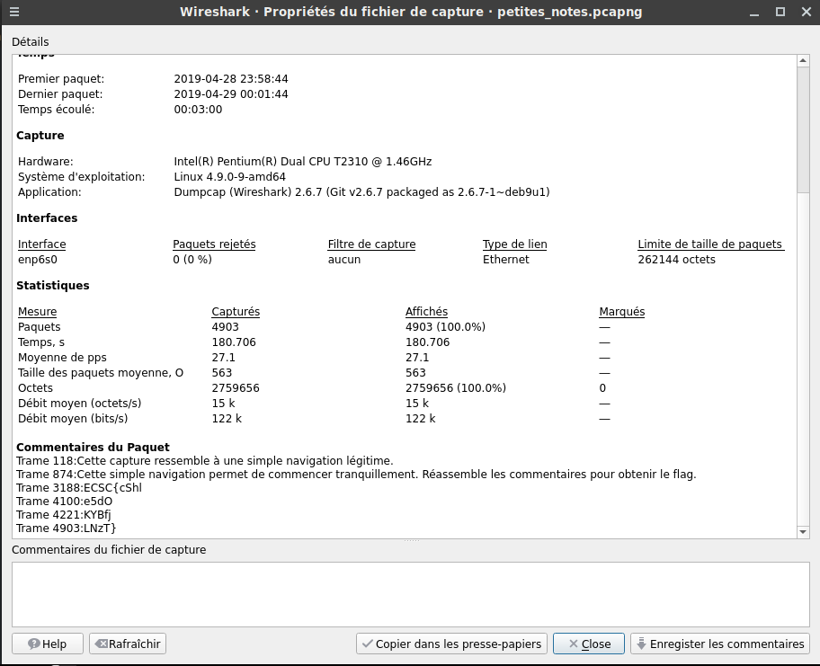

**Petites Notes Write-Up**

"Petites Notes" was the second challenge in the forensics category. Apparently, it will be a challenge that will focus on pcapng format specificity. I didn't know too much about this format, so I just googled ```pcapng analysis``` and found a website that explains how to analyze it step by step. First thing to do after dropping the capture into wireshark, was to check the comments. Let's do the same!

```Statisitics -> Properties of capture file```:



Here is your flag: ```ECSC{cShle5dOKYBfjLNzT} ```

