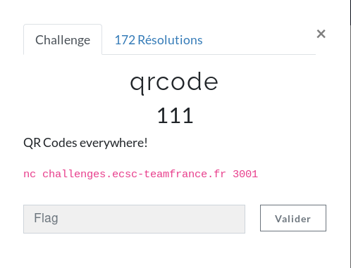
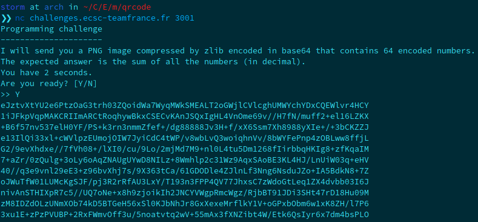

**QrCode Write-Up**

Here is the description of the challenge:



Basically, the first two steps are pretty easy, base64 decode and zlib decompress the image. Then, you'll need to read all the qrcodes. I remember, at the *HackSecuReims* event, my friend spoke about the lib pyzbar in python to read them. Here is my code:

```
storm at arch in ~/C/E/m/qrcode
❯❯ cat qrcode.py                                                                                                                                               [17:52:24]
from pwn import *
from base64 import b64decode
from zlib import decompress
import cv2
from pyzbar import pyzbar

r = remote('challenges.ecsc-teamfrance.fr', 3001)
res = r.recvuntil('Are you ready? [Y/N]')

r.sendline('Y')

#slicing the result to get only the b64
res = r.recvuntil('What is you answer?')[4:-20]

#uncompress the data
qrcode = b64decode(res) 
qrcode = decompress(qrcode)

image = open("image.png", "wb+") #write the image of the chall in a file
image.write(qrcode)

# load the input image
image = cv2.imread("image.png", 1)

# find the barcodes in the image and decode each of the barcodes
barcodes = pyzbar.decode(image)

# loop over the detected barcodes
flag = 0
for barcode in barcodes:
    flag += int(barcode.data.decode("utf-8")) #decrypt qrcode and do the sum

r.sendline(str(flag))
r.interactive()
r.close()
```

Pwntools gives us the ability to easily interact with a server, so I used it in the script. That's it.