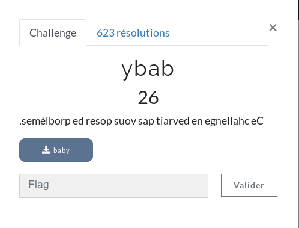
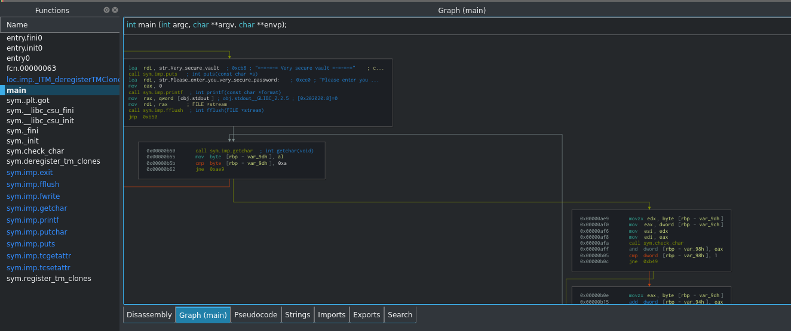
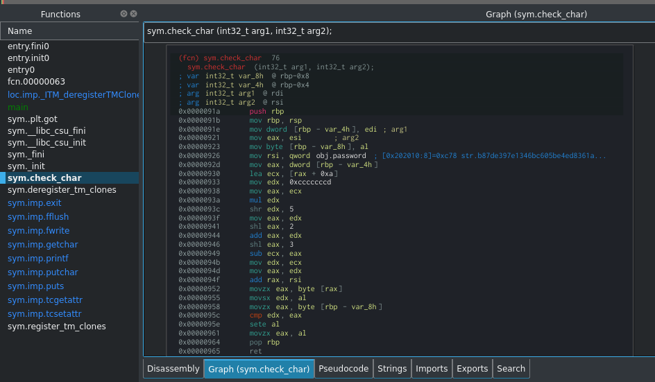
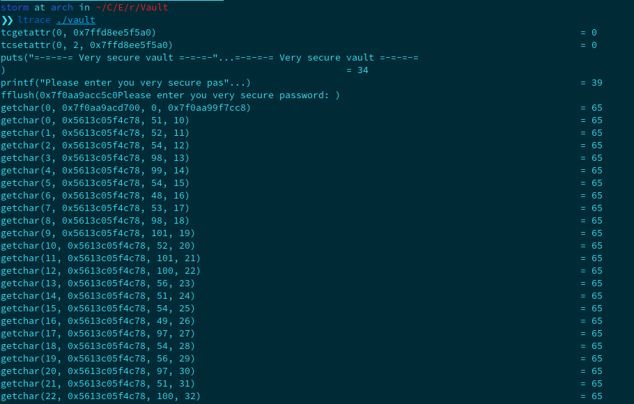
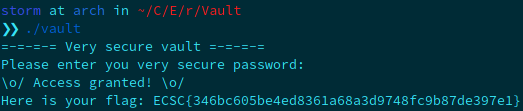

**Vault Write-Up**

Vault was the second challenge in the reversing category. Things seriously start with this binary. While looking for main function in cutter, we can see a call to a function that checks the chars:



Let's take a look at this function!



It performs several operations, some shifting etc. As I am a lazy slob guy, I took ltrace to debug the prog. When it asked me the very secure password, I entered a buffer of some fourty 'A'.

Let's have a look at the result:



The getchar function compares our input with ascii value (after addr 0x5613c05f4c78), if you put them into characters, you'll get the password. I just use chr() function with python, and it prints me the pass: ```346bc605be4ed8361a68a3d9748fc9b87de397e1```

Let's try it with the binary:

