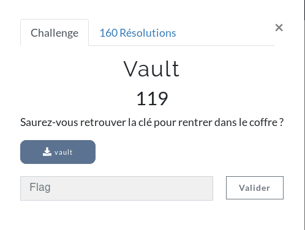

**Ybab Write-Up**

This challenge was the first one of the reversing category, it was solved by most of the players. Indeed, we were given a binary, I just put it in cutter.


The main function only loads and prints a string that roughly says: "you won't get the flag". If you look carefully at all the functions available in the windows on the left, a function seems interesting: ```forever alone```

Let's analyze it!


It just prints the flag, easy one! Flag: ```ECSC{cdcd13c4c81a23a21506fa8efa5edff781e9fe80}```

