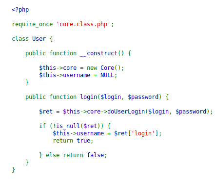
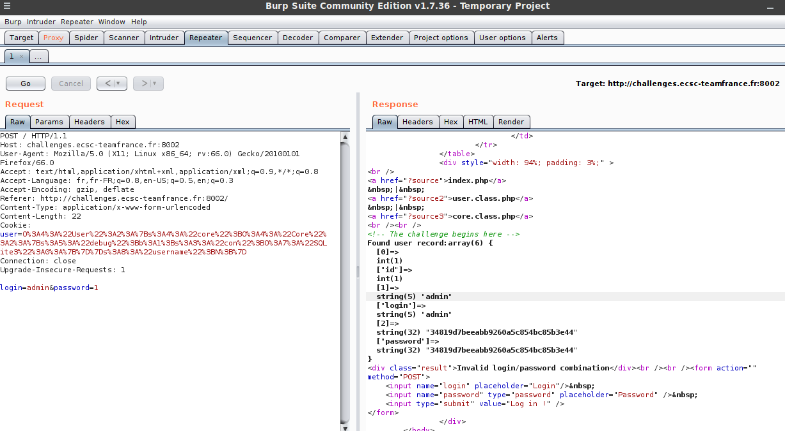

**Jack The Ripper Write-Up**

This is the second challenge in the web category.  Let's visit the website:


We have an access to the source code! Let's have a look at the main page, index.php:


The vulnerability appears to be here: ```unserialize($_COOKIE['user']);```

As we can deserialize an object, we can manipulate all properties that stand in a defined class or constructor. Let's see the other source code:



Hm, okay, let's see the last source code:


A debug variable is set to False in the constructor. Maybe we should modify it. In order to have the serialize object, I ran all of the code in a sandbox, create a new user and print the serialize object:


The serialize object is ```O:4:"User":2:{s:4:"core";O:4:"Core":2:{s:5:"debug";b:0;s:3:"con";O:7:"SQLite3":0:{}}s:8:"username";N;}```

You can see that the debug is set to the boolean 0, which means false. Modify the object as follow:

```O:4:"User":2:{s:4:"core";O:4:"Core":2:{s:5:"debug";b:1;s:3:"con";O:7:"SQLite3":0:{}}s:8:"username";N;}```

Now, URLencode the payload and send it with burp:



Ok, the user is admin and we have the md5 hash of the password. Let's crack it, and get the password which is ```mypassword```

