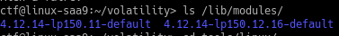

​						 **\*Write-Up OpenMe, HackSecuReims 2019***

 	<u>**TL;DR**</u>

 	This challenge was one of the hardest forensic challenge of the event. I didn’t manage to flag it during the event because I built the profile with an outdated kernel (one version older). I have tried hard at home and hopefully flag it a day after the event. I’m doing this Write-Up because I don’t know anyone who ever performed a dump analysis of openSUSE linux, while writting a good report of the process. I will try to explain the process clearly, and hope that it will maybe help you one day.

 	**<u>Analyzing the dump</u>**

 	First of all, I tried to check the image profile of the dump with volatility. Unfortunately, there was only one correspondence: it was with an old linux kernel that I used for a challenge some weeks ago. As it is a linux dump, I should determine the version of the kernel to analyze it:

 `storm at arch in ~/H/f/openme`

 `↪ strings openme.dmp | grep "Linux version" | sort | uniq`                                                                                      

  `ID_MODEL_FROM_DATABASE=Raptor 4000-L [Linux version]`

  `ID_MODEL_FROM_DATABASE=Raptor 4000-LR-L [Linux version]`

 `Linux version 4.12.14-lp150.12.16-default (geeko@buildhost) (gcc version 7.3.1 20180323 [gcc-7-branch revision 258812] (SUSE Linux) ) #1 SMP Tue Aug 14 17:51:27 UTC 2018 (28574e6)`

 `MESSAGE=Linux version 4.12.14-lp150.12.16-default (geeko@buildhost) (gcc version 7.3.1 20180323 [gcc-7-branch revision 258812] (SUSE Linux) ) #1 SMP Tue Aug 14 17:51:27 UTC 2018 (28574e6)`

 `Raptor 4000-L [Linux version]`

 `Raptor 4000-LR-L [Linux version]`

As you can see, it is an openSUSE linux profile. After doing this, we need to install an openSUSE image in our favorite hypervisor, but we must choose the right version:

 *storm at arch in ~/H/f/openme*

 `↪ strings openme.dmp | grep "SUSE" | sort | uniq`    

` suserelease:    openSUSE Leap 15.0`

 `suserelease=openSUSE Leap 15.0`

 After installing openSUSE in a virtual machine (about 1 hour) we get it.

 

 	<u>**State of the Art:**  **create the profile**</u>

 

 	Because it was the first time I used openSUSE, I had a lot to learn. While searching for how to make an openSUSE profile, I found one article that explains the process but as you will see, it is too old and doesn’t work in our case. The article link is here: <https://www.evild3ad.com/3610/creating-volatility-linux-profiles-opensuse/>

 	As instructed by the article, I first installed subversion with zypper. But the command for installing volatility did not work. Instead, I install volatility with git and it worked perfectly. Then, I installed libdwarf-tools, make and gcc with zypper as written in the article. Next is the harder part of the challenge: installing the correct kernel. I started by installing *kernel-devel-4.12.14-lp150.12.16* as it is the kernel of the image dump. Zypper, the openSUSE package manager was not able to find this kernel. Thus, I searched online and figured out how to install it : I should use rpm package.

  

 I downloaded the binary package and tried to install it with  *sudo rpm* *U mypackage.rpm*. Unfortunately, there were some dependencies that I had not installed. So, I installed them with zypper (just read your errors and install the package you’ve not). Next, to get the *lib/modules/mykernel* directory, I need to install the *kernel-source-4.12.14-lp150.12.16* package.  

  

 As I already have the VM I used to flag the challenge, I have this package installed. Then, I looked into  /*lib/modules* to see if I had the correct kernel installed:

  

 Yes the kernel is installed, we can create the *module.dwarf* file using volaitlity. I went into the directory /*home/ctf/volatility/tools/linux/* and modified the Makefile as I was not running the right kernel (and didn’t want to reboot):

  

→ This is theoriginal Makefile with a variable that take our actual kernel to build the module.dwarf file.

 

 → This is the new Makefile, I just replaced the var with the kernel directory I wanted.

Then I did *make:*

  

 Next, we need to get the system-map file in /boot to finish our profile. In order to create this file, I simply installed:

  

 Now we check the /boot dir to see if the system map is present :

  

 We can now create our profile ! Let’s zip it into openme.zip:

  

 Just verifying that the profile is recognized by volatility:

  

 Perfect, we can use it to analyze our dump.

 

 	<u>**Flag the challenge: analyze** **the dump**</u>

 

 	First of all, I used the command linux_bash to see if the user did something interesting for us. I highly recommend you to start with this command while analyzing a memory dump. Indeed, users most often do something interesting in a command line: they can be either using a tool to encrypt something (maybe VeraCrypt sometimes) or just a zipfile with a password that might be interesting (like in our case).

  

 As we can see, the user zip a flag.png into flag.zip with a password. First, enumerating all the files in one file, then identify the offset of the file *flag.zip* to extract it:

  

 Here we have the offset of the file ! Let’s retrieve it with linux_find_file:

  

 Then, just unzipping the zip with the password the user used to zip it (see in the screen above):

  

 Opening the image and get the flag :-)

  

 	To conclude, as you have maybe guessed, the entire problem result in the fact that there is few documentations in openSUSE linux. As you have seen, when you have the correct profile to analyze the dump, this is easier because you just use an automated tools to retrieve informations include in the dump. In fact, I did this challenge because I found pity that no one flag it or even try it in depth. Indeed, it requires patience and lot of documentation reading to do it but that’s a good way to progress I think. Even if after ten hours of try and fails I did not succeed, I never gave up and did this challenge some hours after the CTF at home. Regardless, if I have an advice for you guys, it is to never give up, RTFM and believe in your dreams.

 <!--Twitter: @Anton86077261-->