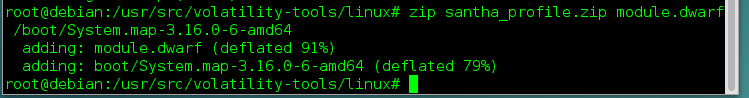
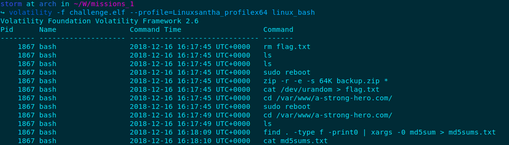
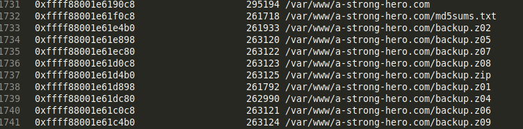
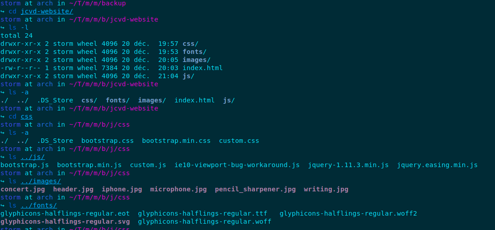
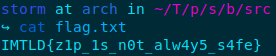

<u>*Write-Up Forensic: Mission impossible 1*</u>

**TL; DR**

This challenge was the hardest forensic that I managed to flag in the SantHacklaus CTF. At the beginning of the task, we got a challenge.elf file and his md5sums. After a brief analysis, we found the kernel of the memory dump.

**Creating the profile**

First of all, the kernel was a debian with Linux version 3,16,0-6-amd64, quite an old version!

    storm at arch in ~/W/missions\_1
    ↪ strings challenge.elf | grep "Linux version" | sort | uniq 19:09:54
    2018-12-16T11:14:09.150996-05:00 virtual-debian kernel: Linux version 3.16.0-6-amd64 (debian-kernel@lists.debian.org) (gcc version 4.9.2 (Debian 4.9.2-10+deb8u1) ) \#1 SMP Debian 3.16.57-2 (2018-07-14) 
    Dec 16 11:14:09 virtual-debian kernel: Linux version 3.16.0-6-amd64 (debian-kernel@lists.debian.org) (gcc version 4.9.2 
    (Debian 4.9.2-10+deb8u1) ) \#1 SMP Debian 3.16.57-2 (2018-07-14)
​    forensic@debian:~$ sudo apt-get install linux-image-3,16,0-6-amd64 linux-headers-3,16,0-6-amd64 volatility-tools

Then reboot and verify your kernel is well installed:

    forensic@debian:~$ uname -a 
    Linux debian 3.16.0-6-amd64 #1 SMP Debian 3.16.57-2 (2018-07-14) x86_64 GNU/Linux
Nice, it works well so now we create the profile for the memory dump after installing volatility tools:

    root@debian:/usr/src/volatility-tools# chmod -R 777 linux/
    root@debian:/usr/src/volatility-tools/linux# make
    root@debian:/usr/src/volatility-tools/linux# zip santha_profile.zip module.dwarf /boot/System.map-3.16.0-6-amd64

Hmm sounds good, I copy the profile to my physical machine and place it in the right directory:

    storm at arch in ~/W/missions_1
    ↪ sudo cp ~/Documents/santha_profile.zip /usr/lib/python2.7/site-packages/volatility/plugins/overlays/linux

**Starting investigations!**

The first thing I do was to dump the bash\_history to see if there is an interesting command that might help us:

We can see that the user deleted a flag file, and zipped an entire directory to a compressed backup zip file.

Let's see if volatility can retrieve those files:

    storm at arch in ~/W/missions_1
    ↪ volatility -f challenge.elf --profile=Linuxsantha_profilex64 linux_enumerate_files > files.txt
There were many files in the directory */var/www/a-strong-hero.com/* so I’ll only tell and show you what was interesting:

I dumped these files using this command below (example for one file):

    storm at arch in ~/W/missions_1
    ↪ volatility -f challenge.elf --profile=Linuxsantha_profilex64 linux_find_file -i 0xffff88001e61c0c8 -O backup/backup.z06
Now it’s time to reconstitute the entire archive with the ten parts:

       storm at arch in ~/W/missions_1
        ↪ zip -s- backup.zip -O fullbackup.zip
After that, we tried to unzip the archive but it was a protected zipfile. I tried to go on a zip password recovery website to get the pass but it couldn’t find it. Furthermore, I tested a tool named fcrack but it didn’t find the password either.

**Crack the zip password and find the flag**

While searching on the web during more than 3 hours, I managed to find an interesting blog (old but gold): <http://www.securiteam.com/tools/5NP0C009PU.html>

So I downloaded pkcrack software and then, the most tedious and long task began. After a zipinfo on the fullbackup.zip, we could see this:

    storm at arch in ~/T/m/m/backup
    ↪ zipinfo /home/storm/Téléchargements/mission\_impossible/missions\_1/filesystem/fullbackup.zip 20:56:27
    Archive: /home/storm/Téléchargements/mission\_impossible/missions\_1/filesystem/fullbackup.zip
    Zip file size: 554334 bytes, number of entries: 31
    -rw-r--r-- 3.0 unx 30 TX stor 18-Dec-16 16:57 flag.txt
    drwx------ 3.0 unx 0 bx stor 18-Dec-16 15:51 jcvd-website/
    drwx------ 3.0 unx 0 bx stor 18-Dec-16 15:51 jcvd-website/js/
    -rw-r--r-- 3.0 unx 6148 BX defN 18-Dec-16 15:51 jcvd-website/js/.DS\_Store
    -rw-r--r-- 3.0 unx 36816 TX defN 18-Dec-16 15:51 jcvd-website/js/bootstrap.min.js
    -rw-r--r-- 3.0 unx 95957 TX defN 18-Dec-16 15:51 jcvd-website/js/jquery-1.11.3.min.js
    -rw-r--r-- 3.0 unx 68890 TX defN 18-Dec-16 15:51 jcvd-website/js/bootstrap.js
    -rw-r--r-- 3.0 unx 79 TX defN 18-Dec-16 15:51 jcvd-website/js/custom.js
    -rw-r--r-- 3.0 unx 641 TX defN 18-Dec-16 15:51 jcvd-website/js/ie10-viewport-bug-workaround.js
    -rw-r--r-- 3.0 unx 5564 TX defN 18-Dec-16 15:51 jcvd-website/js/jquery.easing.min.js
    -rw-r--r-- 3.0 unx 12292 BX defN 18-Dec-16 15:51 jcvd-website/.DS\_Store
    drwx------ 3.0 unx 0 bx stor 18-Dec-16 15:51 jcvd-website/images/
    -rw-r--r-- 3.0 unx 37682 BX defN 18-Dec-16 15:51 jcvd-website/images/concert.jpg
    -rw-r--r-- 3.0 unx 6148 BX defN 18-Dec-16 15:51 jcvd-website/images/.DS\_Store
    -rw-r--r-- 3.0 unx 52003 BX defN 18-Dec-16 15:51 jcvd-website/images/microphone.jpg
    -rw-r--r-- 3.0 unx 49276 BX defN 18-Dec-16 15:51 jcvd-website/images/iphone.jpg
    -rw-r--r-- 3.0 unx 91733 BX defN 18-Dec-16 15:51 jcvd-website/images/header.jpg
    -rw-r--r-- 3.0 unx 26267 BX defN 18-Dec-16 15:51 jcvd-website/images/writing.jpg
    -rw-r--r-- 3.0 unx 133773 BX defN 18-Dec-16 15:51 jcvd-website/images/pencil\_sharpener.jpg
    -rw-r--r-- 3.0 unx 7384 TX defN 18-Dec-16 15:51 jcvd-website/index.html
    drwx------ 3.0 unx 0 bx stor 18-Dec-16 15:51 jcvd-website/fonts/
    -rw-r--r-- 3.0 unx 45404 BX defN 18-Dec-16 15:51 jcvd-website/fonts/glyphicons-halflings-regular.ttf
    -rw-r--r-- 3.0 unx 18028 BX defN 18-Dec-16 15:51 jcvd-website/fonts/glyphicons-halflings-regular.woff2
    -rw-r--r-- 3.0 unx 23424 BX defN 18-Dec-16 15:51 jcvd-website/fonts/glyphicons-halflings-regular.woff
    -rw-r--r-- 3.0 unx 20127 BX defN 18-Dec-16 15:51 jcvd-website/fonts/glyphicons-halflings-regular.eot
    -rw-r--r-- 3.0 unx 108738 TX defN 18-Dec-16 15:51 jcvd-website/fonts/glyphicons-halflings-regular.svg
    drwx------ 3.0 unx 0 bx stor 18-Dec-16 15:51 jcvd-website/css/
    -rw-r--r-- 3.0 unx 6148 BX defN 18-Dec-16 15:51 jcvd-website/css/.DS\_Store
    -rw-r--r-- 3.0 unx 147430 TX defN 18-Dec-16 15:51 jcvd-website/css/bootstrap.css
    -rw-r--r-- 3.0 unx 8335 TX defN 18-Dec-16 15:51 jcvd-website/css/custom.css
    -rw-r--r-- 3.0 unx 122540 TX defN 18-Dec-16 15:51 jcvd-website/css/bootstrap.min.css
    `31 files, 1130857 bytes uncompressed, 599438 bytes compressed: 47.0%
Reading the article, I understood that I had to reconstitute exactly the same archive but with plaintext files, so I extracted all the files in jcvd-website/ (same technique showed above to extract the zip parts), and created the same setup as the zip password protected archive:

I created a flag .txt with the same bytes as the real flag.txt to use pkcrack correctly with our homemade plaintext archive. I zipped this directory into a backup2.zip file.

Now I am able to use pkcrack to find the keys:

    storm at arch in ~/T/p/src`
    ↪ ./pkcrack -C /home/storm/Téléchargements/mission\_impossible/missions\_1/filesystem/fullbackup.zip -c jcvd-website/js/jquery-1.11.3.min.js -P /home/storm/Téléchargements/mission\_impossible/missions\_1/backup/backup2.zip -p jcvd-website/js/jquery-1.11.3.min.js
    
    Files read. Starting stage 1 on Thu Dec 20 22:38:49 2018
    Generating 1st generation of possible key2\_33170 values...done.
    Found 4194304 possible key2-values.
    Now we're trying to reduce these...
    Lowest number: 993 values at offset 28371
    Lowest number: 968 values at offset 27781
    Lowest number: 956 values at offset 27724
    Lowest number: 907 values at offset 27722
    Lowest number: 857 values at offset 27719
    Lowest number: 849 values at offset 27718
    Lowest number: 767 values at offset 27716
    Lowest number: 741 values at offset 27713
    Lowest number: 737 values at offset 27692
    Lowest number: 733 values at offset 27634
    Lowest number: 705 values at offset 27633
    Lowest number: 692 values at offset 27632
    Lowest number: 690 values at offset 27622
    Lowest number: 680 values at offset 27621
    Lowest number: 616 values at offset 27620
    Lowest number: 587 values at offset 27590
    Lowest number: 561 values at offset 27588
    Lowest number: 471 values at offset 27587
    Lowest number: 445 values at offset 27565
    Lowest number: 411 values at offset 27560
    Lowest number: 404 values at offset 27559
    Lowest number: 399 values at offset 27558
    Lowest number: 378 values at offset 27407
    Lowest number: 324 values at offset 27404
    Lowest number: 279 values at offset 27334
    Lowest number: 273 values at offset 27327
    Lowest number: 271 values at offset 27322
    Lowest number: 268 values at offset 27316
    Lowest number: 265 values at offset 27315
    Lowest number: 249 values at offset 27314
    Lowest number: 247 values at offset 27313
    Lowest number: 234 values at offset 27312
    Lowest number: 232 values at offset 27311
    Lowest number: 221 values at offset 27310
    Lowest number: 220 values at offset 27309
    Lowest number: 204 values at offset 27308
    Lowest number: 185 values at offset 27306
    Lowest number: 178 values at offset 27305
    Lowest number: 176 values at offset 27284
    Lowest number: 168 values at offset 27283
    Lowest number: 148 values at offset 27279
    Lowest number: 146 values at offset 27202
    Lowest number: 143 values at offset 27197
    Lowest number: 141 values at offset 27196
    Lowest number: 121 values at offset 27185
    Lowest number: 108 values at offset 27172
    Lowest number: 99 values at offset 27161
    Done. Left with 99 possible Values. bestOffset is 27161.
    Stage 1 completed. Starting stage 2 on Thu Dec 20 22:39:06 2018
    Ta-daaaaa! key0=751f036a, key1=397078fa, key2=d156dfac
    Probabilistic test succeeded for 6014 bytes.
    Ta-daaaaa! key0=751f036a, key1=397078fa, key2=d156dfac
    Probabilistic test succeeded for 6014 bytes.
    Ta-daaaaa! key0=751f036a, key1=397078fa, key2=d156dfac
    Probabilistic test succeeded for 6014 bytes.
    Ta-daaaaa! key0=751f036a, key1=397078fa, key2=d156dfac
    Probabilistic test succeeded for 6014 bytes.
    Ta-daaaaa! key0=751f036a, key1=397078fa, key2=d156dfac
    Probabilistic test succeeded for 6014 bytes.
    Ta-daaaaa! key0=751f036a, key1=397078fa, key2=d156dfac
    Probabilistic test succeeded for 6014 bytes.
To decrypt the zip file, I used a tool named bkcrack. I used the first three keys in input to decrypt the encoded flag.txt:

    storm at arch in ~/T/p/s/b/src
    ↪ ./bkcrack -c flag.txt -C /home/storm/Téléchargements/mission_impossible/missions_1/filesystem/fullbackup.zip -k 751f036a 397078fa d156dfac -d flag.txt                                    [18:26:20] 
    Keys: 751f036a 397078fa d156dfac
    Wrote deciphered text.
And finally get the flag:

=======

