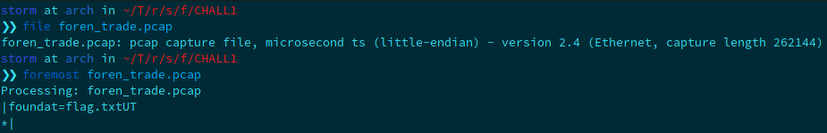
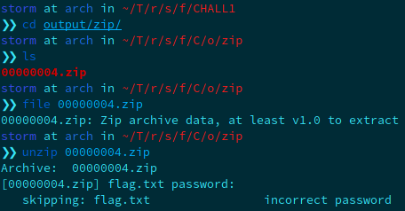
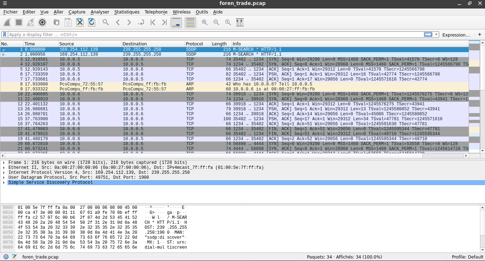
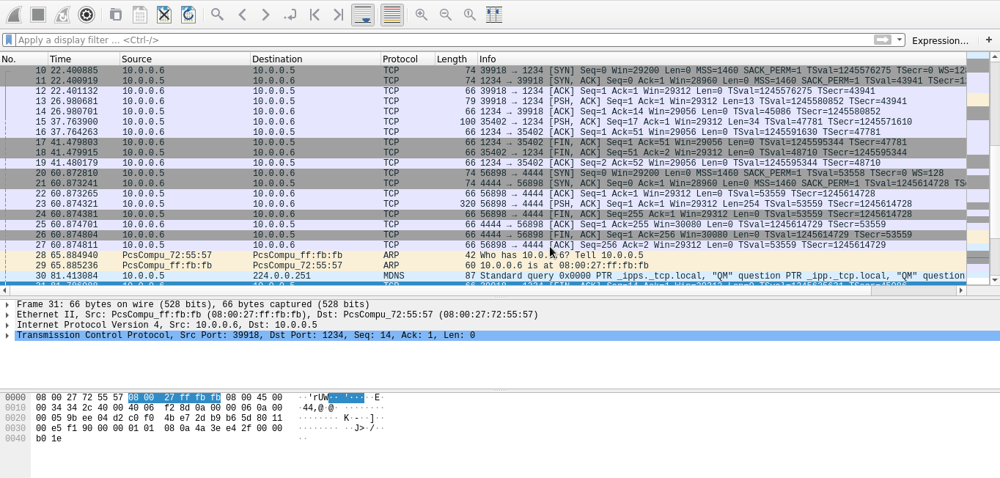
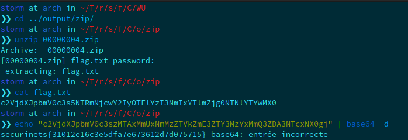

**Forensic Challenge n°1**

For this first challenge, we get a pcap file. As you can see in the following picture, I first tried to extract files that the pcap file may contain using *foremost*. 

Hopefully, we get a zip file but password protected.

 Hm I think that's all we can have using those techniques. Let's take a quick glance to the pcap file, with *wireshark*. When we open the file with the tool, we can see a lot of tcp queries and some arp queries.

Scrolling towards the end, it seems to be an authentification. Let's follow the tcp stream of the request.

Ok, let's test this text as the zip password. Fortunately for us, it works and extract the flag.txt file. Just base64 decode it and we get the flag:

