<u>*Write-Up Forensic : Bret Stiles*</u>

**TL;DR**

This forensic challenge was the second hardest challenge that I managed to do in the Santhacklaus CTF. The last part of the challenge was (from my point of view) extremely hard if you don’t know the tricks. So we get a memory dump, the first step is to determine the OS (Linux / Windows or Mac) in order to create or use the adequat profile. Using volatility we first do an imageinfo:

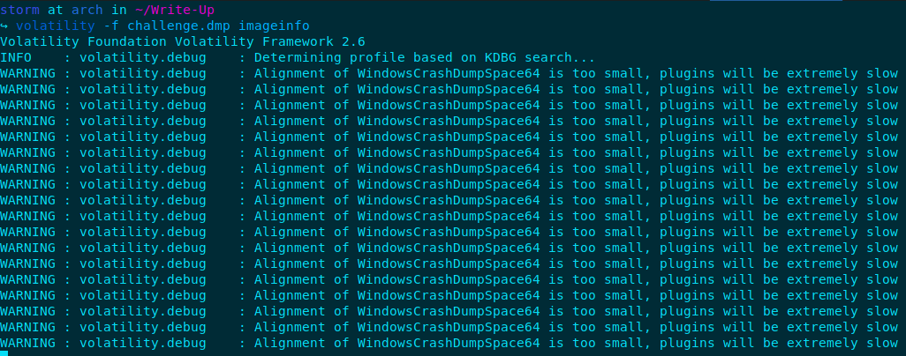

As you can see, it seems to be a Windows crashdump, let’s google to find a way to analyze it.

**Starting the analysis**

After searching on Google how to analyze Windows crash dump (it was my first time) I found an interesting command with volatility:

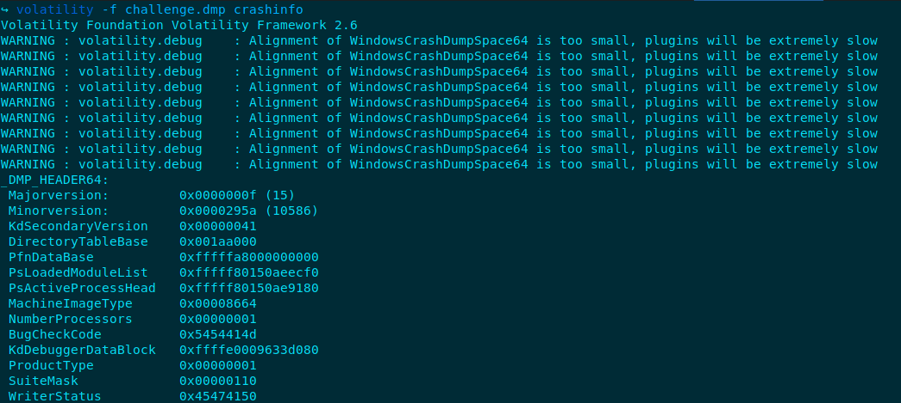

Hmm at this point, my brain was on fire seeing these offsets. First of all I read the information next to the offsets and find something interesting: *MachineImageType 0x00008664*

Let’s google it to see if someone has already performed an analysis on a similar crash dump. Yeah we get a github which indicates that it was a Windows 10 profile. Now, let’s check the process on the memory dump :

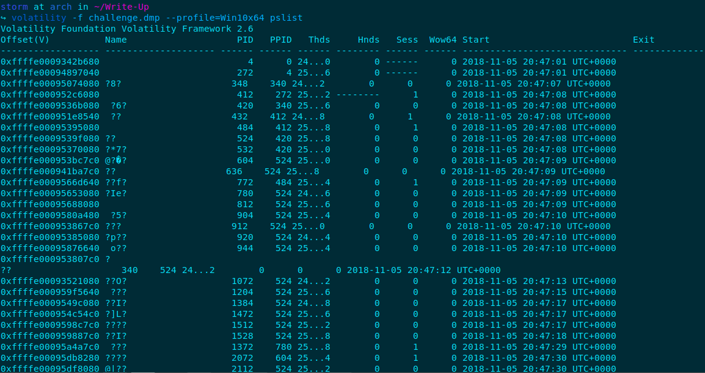

Definitely not the good profile haha. So I continued my research and found a guy on github.com who had the same problem while analyzing Windows 10 crash dump. Someone told him to use the *Win10x64\_10586 profile* to see the processes. Right, let’s do a pslist with this profile!

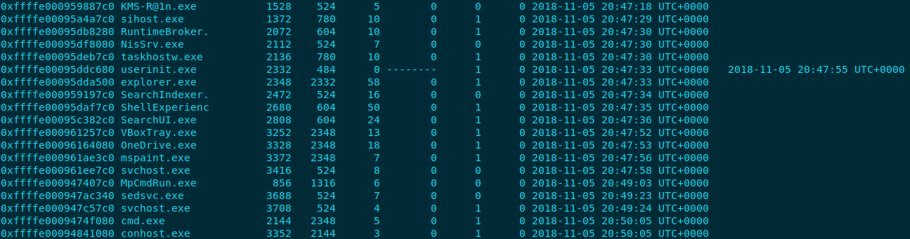

Here was the suspicious processes I detected: <KMS-R@in.exe>, and an explorer.exe which is the parent of a cmd.exe (litterally, the explorer.exe generates a command line prompt). I started with dumping <KMS-R@in.exe> to analyze it, let’s see my process dump:

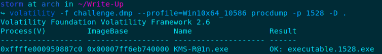

The first thing to do when you have a suspicious executable is to dump it on virustotal or hybrid-analysis.com.

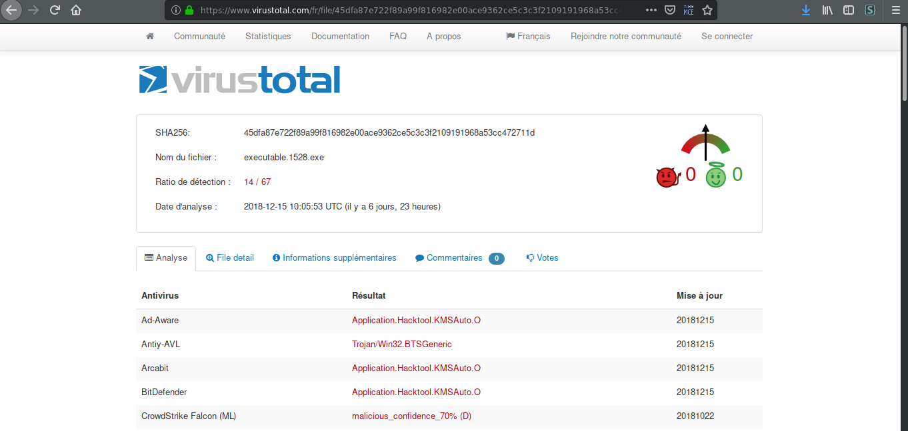

Ok, so it seemed to be an adware. After checking the file details, where nothing interesting was found, I tried to recover the internet history (without success) and also check the clipboard to see if a password or, who knows the flag haha, may be there, but nothing. As I didn’t find much more on this executable and internet, I started retrieving the files, checking for a possible interesting command line :

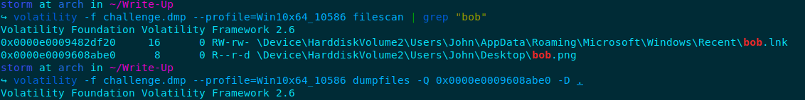

This is not the whole output, it would be too long, but an interesting file on the user’s desktop. Now let’s try to retrieve the file with its offset (in the above screenshot). It didn’t work, weird. Then I tried to display process command-line arguments:

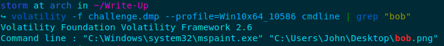

Nice!! The picture was opened with mspaint.exe. Let’s dump the memory of this process using its PID (cf. processes):

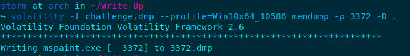

**Finding a way to see the picture and find the flag**

As I explained before, it was the hardest part of this challenge. I didn’t know any techniques to see a picture from the application memory dump. After spending some time on Google, I found a very interesting blog: <https://w00tsec.blogspot.com/2015/02/extracting-raw-pictures-from-memory.html>

We now have the techniques, let’s start the art, copy the process.dmp into process.data to be able to open it with gimp as raw image data :

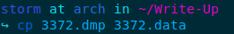

Open it with gimp, find the right width, height and offset;

As mentionned in the tutorial, we set the height near 900, like the width:

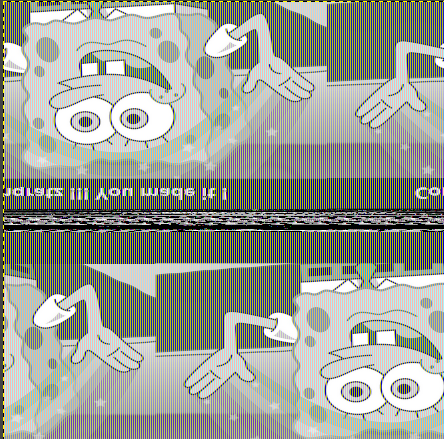

We can see Bob’s picture! The comment says: “Congratz! You made it” but we don’t have the flag. Scrolling the offsets near the one we found this picture, we find it!

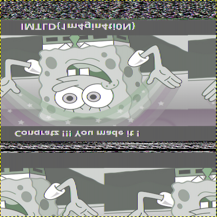

Flag: IMTLD{1m4gin4ti0N}
